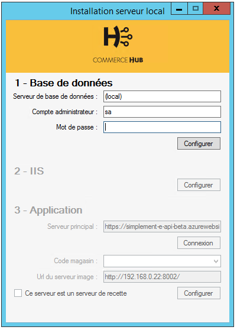

# Installation

.Pour pouvoir installer le rôle serveur local, vous devez vous assurer que le poste rempli les pré-requis suivants :

* Processeur 2ghz ou supérieur, proposant au moins 2 coeurs.
* 8Go de mémoire
* 10Go d'espace disque disponible (+ un espace libre suffisant pour stocker les images, vidéos, etc. que vous souhaitez synchroniser)
* une connexion Internet 4Mbps ou supérieure
* Windows Server 2012 ou supérieur
* une adresse IP fixe (ou un bail DHCP sans date d'expiration) à l'intérieur du magasin

Les logiciels ou composants systèmes suivants devront être installés et configurés :

* Sql Server 2012 ou supérieur, avec le service FullTextSearch (vous pouvez télécharger [Sql Server 2014 With Advanced Services sur le site de Microsoft](https://www.microsoft.com/fr-FR/download/details.aspx?id=42299), veillez à bien choisir la version SQLEXPRADV_x64_FRA.exe ou SQLEXPRADV_x86_FRA.exe). Ce dernier doit être configuré pour accepter les connexions par logins SqlServer en complément de logins Windows.
* Le rôle webservice IIS avec le module asp.net 4.5
* .net Framework 4.5.1

## Télécharger et installer le serveur local

Vous pouvez télécharger le package d'installation du serveur local ici :

[Télécharger le package d'installation (Archive ZIP)](https://datasimplemente.blob.core.windows.net/releases/commerce-hub/SetupStoreServer.zip)

 Une fois l'archive téléchargée, décompressez la dans un dossier temporaire, puis lancer le programme d'installation SetupStoreServer.exe. L'interface de configuration suivante s'affichera :

### Configuration de la base de données

La première étape à réaliser est la configuration de la base de données. Pour cela vous devrez fournir :

* le nom de la source de données. Vous pouvez utiliser _(local)_ si vous avez installé SqlServer sur la machine active. Attention, si vous avez installé SqlServer Express, il est probable que vous ayez besoin de suffixer le nom de la machine d'un nom d'instance. Le paramètrage par défaut de l'installation créé une instance SQLEXPRESS, le nom de la source de données devenant alors _#NOM_DE_LA_MACHINE#_\SQLEXPRESS.
* le login du compte administrateur, ou d'un compte ayant les droits pour créer ou restaurer une base, des logins et pour effectuer des opérations de modification de structure
* et son mot de passe.

Cliquez simplement sur _Configurer_ une fois ces informations fournies. L'installation de la base et sa configuration prend quelques secondes, pendant lesquelles l'application sera désactivée.

### Configuration de IIS

C'est probablement l'étape la plus simple : vous n'avez aucun paramètre à renseigner, cliquez sur Configurer pour lancer l'installation. Le traitement peut durer jusqu'à quelques minutes.

### Configuration de l'application

Vous allez maintenant connecter votre serveur magasin avec votre environnement. Pour cela, vous devrez renseigner l'url de votre serveur API principal. Si vous utilisez notre service Saas, laissez la valeur par défaut

Cliquez ensuite sur Connexion et suivez les étapes de connexion. Attention, une boite de dialogue vous demandant si vous faite confiance au site pourra s'afficher sur certaines versions de Windows. Si tel est le cas, ajoutez l'url de votre serveur API à la liste des url considérées comme sécurisées.

Connectez vous avec un compte disposant des droits de gestion des fonctionnalités, et approuvez la connexion sécurisée.

La liste des magasins sera alors rempli avec tous vos magasins, choisissez celui dans lequel vous être en train de déployer le serveur puis cliquez sur Configurer.

### Configuration avancée

Le champ Url du serveur image vous permet de vérifier que le serveur sera configuré sur la bonne adresse IP. Si vous êtes en train de stager un serveur en dehors du magasin, nous vous invitons à remplacer l'adresse IP dans ce champ par celle qui sera attribuée au serveur en magasin.

Cochez la case "Ce serveur est un serveur de recette" si le serveur n'est pas destiné à être utilisé en production.

### Installation en ligne de commande

Vous pouvez aussi procéder à une installation en ligne de commande. Les différents paramètres acceptés sont :

* **/noprompt** : obligatoire, evite l'affichage de l'interface graphique
* **/dbserver** : lance l'installation de la base de données, et demande que vous passiez juste après ce paramètres :

* **servername=**_[nom du serveur]_ : le nom du serveur de base de données, ou (local) si vous utilisez un serveur sur la même machine
* **login=**_[identifiant]_ : le login d'un user sql serveur ayant des droits d'administration
* **password=**_[mots de passe]_ : et son mot de passe

* **/installapps** : effectue l'installation des différentes applications sur le serveur
* **/connectsrv** : connecte le serveur local au cloud et configure toutes les informations pour la synchronisation des données, vous devez fournir les informations suivantes :

* **mainsrv=**_[serveur principal]_ : l'url complète du serveur API (par exemple : https://api.server.commerce-hub.io/)
* **login=**[identifiant] : le login d'un utilisateur ayant le droit de gérer les périphériques magasins
* **password=**[mots de passe] : et son mot de passe
* **rjsid=**_[identifiant raison juridique]_ : l'identifiant du dossier (de la raison juridique) auquel sera associé ce serveur
* **picturesrv=**_[serveur d'images]_ : l'url du serveur pour les images **[non obligatoire]**.
* **storecode=**[code magasin] : le code du magasin auquel sera associé ce serveur
* **isstaging=**_[true|false]_ : true pour préciser que ce serveur est un serveur de recette **[non obligatoire : false par défaut]**

## Précharger les données

Si vous utilisez le serveur local avec une base produits volumineuse, vous pouvez pré-charger certaines données de façon à éviter un temps de synchronisation important. Vous pouvez, par exemple, regrouper toutes vos images sur une clef usb afin de ne pas les télécharger depuis vos serveurs. Le serveur local peut intégrer des données provenant d'un disque amovible (clef USB, disque e-sata, etc.) si celui-ci suit la structure de dossiers suivante :

<pre>\commerce-hub  
   \import  
      \imgs : dossier pour les images  
      \sync : dossier pour les données catalogue</pre>

Vous pouvez aussi utiliser le dossier _commerce-hub\import_ sur votre disque d'installation (par défaut : _c:\commerce-hub\import_)

### Images produits

Placez les images dans le dossier commerce-hub\import\imgs. Vous devez déposer toutes les images dans le même dossier et ne pouvez pas créer de sous dossier. Chaque image devra avoir l'exact même nom de fichier que l'image originale à télécharger. Par exemple, si votre image "web" se trouve à l'url : _http://www.miam-miam-corp.com/images/produits/ref-12345.jpg_, votre fichier local devra être appelé _ref-12345.jpg_.