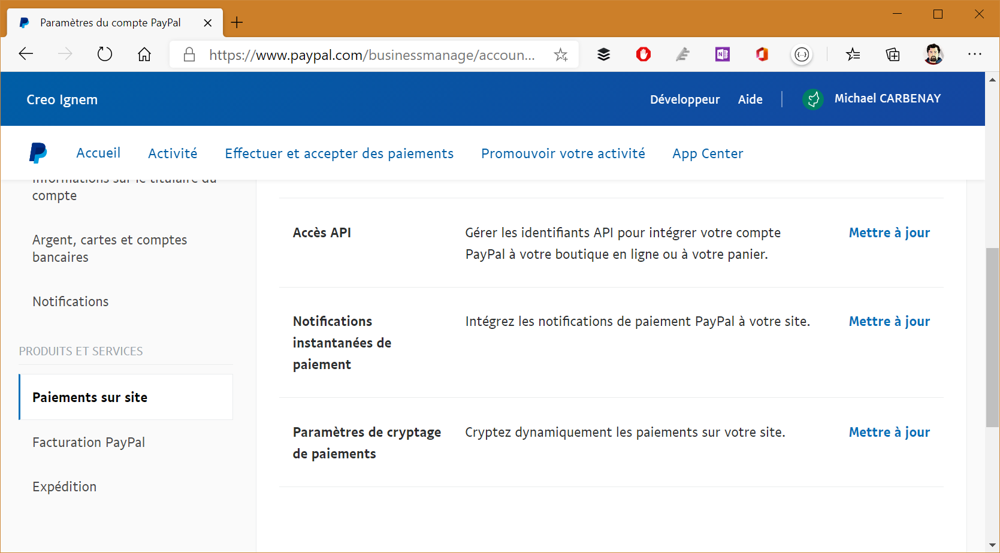
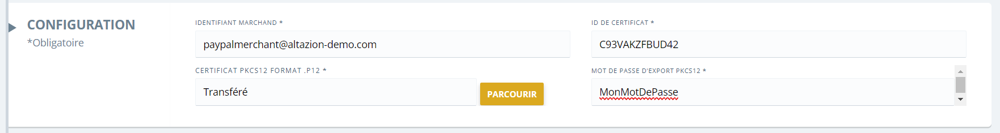

# Intégrer Paypal


## Sécuriser vos échanges

Pour assurer un cryptage optimal entre Paypal et nos solutions, vous devrez créer un certificat et l'enregistrer d'un coté et de l'autre. Cette manipulation est assez complexe, n'hésitez pas à contacter notre support technique pour vous aider à la réaliser.

### Préparer votre environnement Paypal

Pour démarrer, vous aurez besoin de créer un certificat avec l'outil OpenSSL. Vous pouvez télécharger ce dernier ici : https://slproweb.com/products/Win32OpenSSL.html.

> [!WARNING]
> La version 3.0 de OpenSSL semble poser problème sur Windows 10 19041 et supérieur et génère des certificats incompatibles. Nous vous invitons à télécharger la version 1.1 pour plus de sécurité.

Une fois ce programme installé, vous devrez utiliser une ligne de commande pour lancer quelques commandes :

- `genrsa -out cleprivee.pem 1024` : cette commande génère une clé privée RSA de 1024 bits qui est stockée dans le fichier cleprivee.pem.
- `req -new -key cleprivee.pem -x509 -days 365 -out moncertificat.pem` : Cela étape permet de générer un certificat public à l'aide de votre clé privée. Ce certificat aura une durée effective d'un an. Nous vous invitons à augmenter le délai `-days 365` si vous souhaitez avoir un délai plus long. _Les informations saisies pendant cette phases doivent être renseigné au plus juste pour éviter tout conflit avec Paypal_
- `pkcs12 -export -out certificat.p12 -in moncertificat.pem -inkey cleprivee.pem` : le mot de passe est à conserver pour pouvoir ajouter le fichier dans nos outils et sur paypal.


> [!IMPORTANT]
> Si vous utilisez plusieurs adresses pour vous connecter à Paypal, assurez vous de bien utiliser les identifiants (e-mail) du compte Paypal Business principal. Utiliser un compte secondaire pour faire ces opérations résultera très probablement en un mode de paiement invalide.

Une fois cette étape réalisée, le fichier certificat.pem est à uploader sur Paypal. Pour cela, à partir de votre compte "Paypal Professsionel", rendez vous dans les _Paramètres du compte_ puis dans _Produits et services_ > _Paiements sur site_ :

.

Vous pourrez ensuite _Ajouter_ votre certificat, en faisant attention de choisir le fichier `moncertificat.pem` (ou en adaptant le nom du fichier si vous l'avez renommé).


> [!NOTE]
> Si vous souhaitez de l'aide sur cette partie, notre support technique est à votre disposition.

### Configurer dans Altazion Office

.

Vous devrez renseigner le bloc spécifique à Paypal dans votre mode de règlement. Les informations à saisir sont :

- **Identifiant Marchand** : l'email principale du compte Paypal Business
- **Id du certificat** : l'identifiant récupéré à la fin de l'upload sur l'interface de Paypal
- **Certificat PKCS12 (format .p12)** : téléchargez le fichier .p12 généré précédemment
- **Mot de passe d'export PKCS12** : saisissez le mot de passe utilisé pour sécuriser le fichier .p12.

### En cas d'erreur

Si l'une ou l'autre des étapes s'est mal passé ou que vous avez réalisé une erreur, le mode de paiement paypal peut avoir plusieurs comportements incorrects :

- Le paiement reste bloqué sur la page "d'attente de connexion"
- L'arrivée sur le site de Paypal renvoie une erreur

#### Blocage sur la page d'attente

Si vous restez bloqué sur la page d'attente, nous vous invitons à afficher le code source de la page : vous y trouverez l'erreur sous forme d'un commentaire HTML. Vous trouverez ci-dessous les différents messages d'erreurs les plus fréquents et leur procédure de résolution

##### Votre mot de passe est incorrect :

```html
<!-- Exception : System.Security.Cryptography.CryptographicException: The specified network password is not correct. -->
```
Les informations saisies dans le champ "MOT DE PASSE D'EXPORT PKCS12 *" n'ont pas fonctionné pour décrypter le fichier .p12 uploadé. 

#### Erreur sur le site Paypal

**Un problème est survenu lors de vérification de la signature de votre commande sécurisée. Veuillez contacter le marchand.**

Il y a probablement un mismatch entre les informations que vous avez saisi dans Office et dans Paypal, la cause la plus fréquente est de ne pas avoir téléchargé le même jeu de fichier .pem sur paypal et .p12 sur Altazion.


