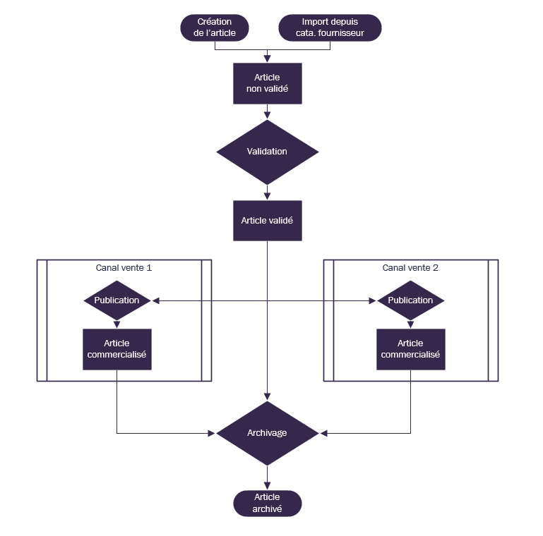

# Cycle de vie

Les articles passent par un certain nombre d'étapes, au cours de leur existence dans nos outils.

Lorsque vous créez un article, il est d'abord dans un phase d'élaboration, pendant laquelle l'article ne peut pas être utilisé pour des opérations de vente. Cette étape vous permet de renseigner les informations nécessaires à la bonne utilisation d'un article, de lui associer des documents, images, video, etc., d'en définir le tarif etc.

Une fois les informations renseignées, vous pouvez valider un article puis le publier sur un ou plusieurs canaux de vente. Ces opérations peuvent être faites simultanément ou de façon séparée. Un article validé et publié sur un canal de vente - par exemple : votre site e-commerce - sera visible sur celui-ci. En fonction de vos règles de gestion, il pourra également être acheté ou commandé.

Lorsque vous souhaitez retirer définitivement un article de votre catalogue produit, vous pouvez l'archiver : cette opération rendra l'article invisible dans tous vos outils et vos canaux de ventes.

## Schéma du cycle de vie

