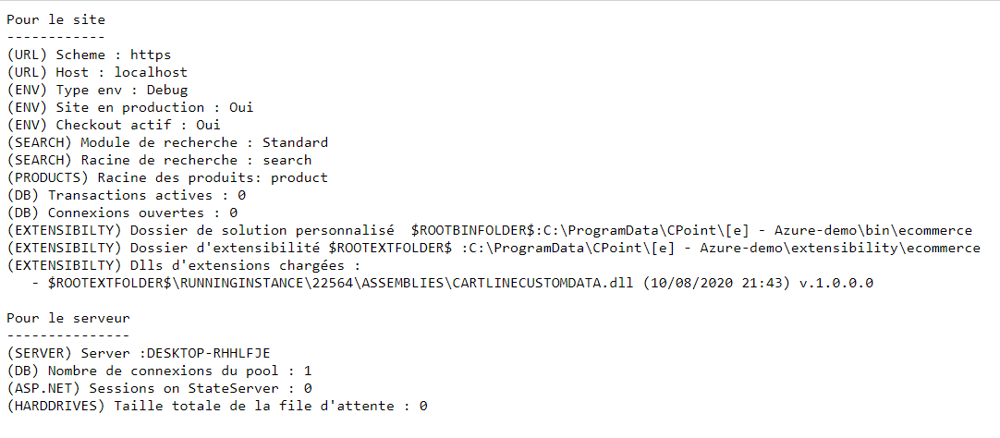

# Page d'état de l'application

La page d'état _status.ashx_ vous permet d'obtenir des informations d'état et de configuration de l'application Commerce. Ces données vous permettront de connaitre l'état et éventuellement de détecters des erreurs de paramétrage.

Elle est accessible à l'url : `{url_de_votre_site}/admin/status.ashx`. Vous devez être authentifié avec un compte d'administration pour avoir accès à celle-ci ou utiliser l'authentification légère propre à cette page.

## Informations affichées

Les données sont regroupées en deux grands domaines : la configuration du site et l'état du serveur.

> [!WARNING]
> Le contenu de ce fichier peut différer en fonction de votre environnement et des modules actifs 

### Pour le site

|Valeur|Détails|
|---|---|
|(URL) Scheme|Protocole utilisé pour accèder à votre site. **Depuis début 2020, vérifiez que cette option est bien https : de nombreux navigateurs proposant des mesures de sécurité accrues et ne permettant plus d'utiliser le protocole http que pour des sites non interactifs**|
|(URL) Host|Le nom DNS utilisé lors de l'appel|
|(ENV) Type env|Le type d'environnement. Si vous êtes en installation "OnPremise", vous pouvez influer sur le mode de fonctionnement via les fichiers de configuration|
|(ENV) Site en production|Si un site n'est pas "en production", seul les appels authentifié comme provenant du développeur sont possibles|
|(ENV) Checkout actif|Si un site e-commerce n'est pas "actif en checkout", les commandes et mises au panier sont désactivées|
|(SEARCH) Module de recherche|Le module de recherche actif|
|(REWRITING) Module de rewriting|Le module d'url rewriting actif|
|(DB) Transactions actives|Le nombre de transaction à la base de données actuellement actives|
|(DB) Transactions actives|Le nombre de connexions à la base de données actuellement actives|

### Pour le serveur

||Description|
|---|---|
|(SERVER) Server|Le nom du serveur|
|(DB) Nombre de connexion du pool|Le nombre de connexion établies sur la base de données (max 100)|
|(ASP.Net) Sessions on StateServer|Le nombre de sessions actives.|
|(HARDRIVES) Taille totale de la file d'attente|Le nombre d'opération I/O en attente sur les disques. Un nombre élevé peut cacher un problème de surcharge du serveur|

## Authentification légère

Merci de vous rapprocher de notre équipe technique pour plus d'informations.