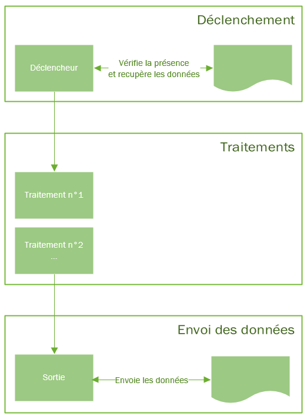
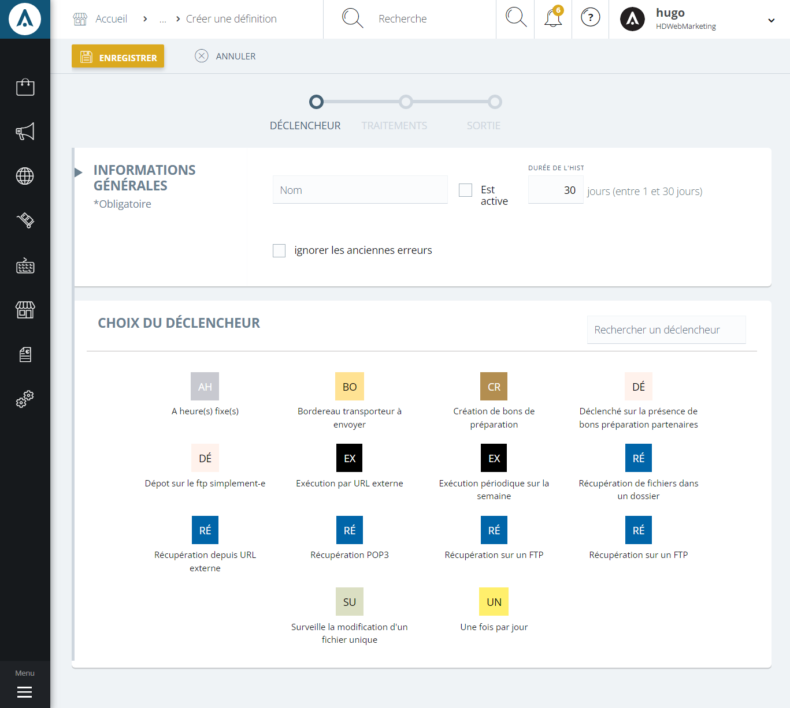

# Principe des médiations

 Les échanges EDI sont assurées par le module des médiations qui permettent de définir des pipelines pour l'entrée ou la sortie de données depuis vos outils. Chaque processus EDI est composé de trois éléments :

*   un **déclencheur**, qui permet de réagir à la réception d'un flux de données (réception d'un fichier par FTP, d'un message HTTP, etc.), à l'apparition d'un évènement déclencheur (la création d'un enregistrement particulier en base de données par exemple), à l'expiration d'un timer etc.
*   un ou plusieurs **traitement(s)**, qu'il s'agisse de l'intégration de data, d'un export, etc.
*   un **transfert**, dans le cas d'une médiation ayant un flux de sortie, cette étape consiste à l'envoi, par quelque moyen que ce soit, de ce flux à un système tiers.

 A chaque fois que les clauses définie par le déclencheur sont validées, une nouvelle instance de la médiation est créée afin de traiter ou créer les données. Vous pouvez par exemple créer :

*   une médiation qui attend l'arrivé d'un fichier des articles ET d'un fichier prix d'un fournisseur et qui les intègre tous les deux dans [votre catalogue fournisseur](/fr-fr/office/gestion-commerciale/achats/Fournisseurs/catalogue.md).
*   une médiation qui crée un fichier de stock toutes les demi-heures et l'envoi à un revendeur
*   une médiation qui crée un fichier de commande pour tous vos bons de préparation sous-traités à un fournisseur Drop Shipping.
*   etc.

>[!Note] 
Il existe des médiations "systèmes" qui sont gérées directement par la solution et qui ne peuvent être modifiée qu'en partie.

## Type de médiations

Un workflow EDI est appelée, dans nos solutions, une "définition de médiations", vous pourrez retrouver cette fonctionnalité dans la partie _Paramètres_ > _Communications_ > _Médiations_

Vous y retrouverez la liste des toutes les définitions et la possibilité de les créer ou les modifier.

