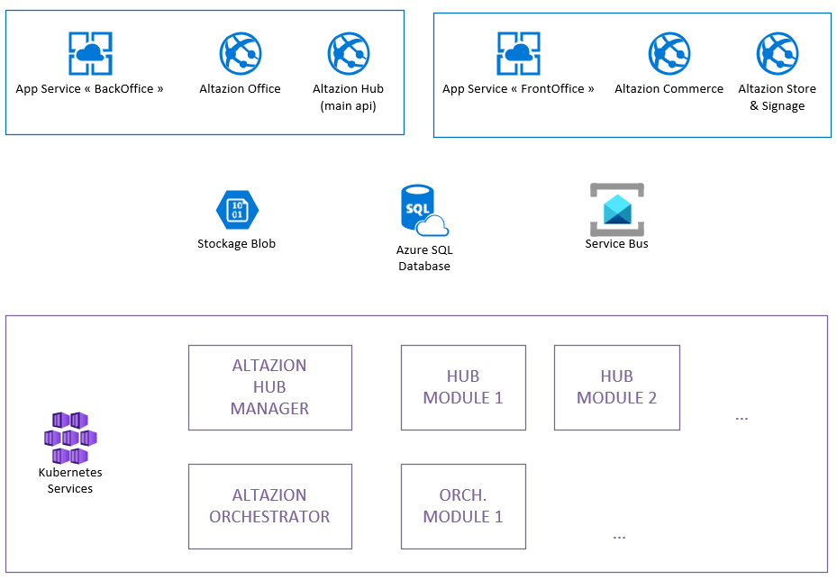
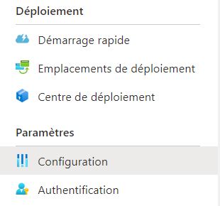

# Déploiement sous Azure

## Resources

Le schéma de déploiement minimal suggéré pour nos solutions en mode "Isolated" est le suivant :

Vous aurez besoin :

- d'une base de données SQL Azure (ou éventuellement d'un serveur SQL Server 2016+ hébergé sur Azure) pour stocker vos data
- d'un service bus pour l'intercommunication des modules
- d'un service de stockage Azure pour vous fichiers et médias

Coté hébergement applicatif, nous vous conseillons d'utiliser la configuration suivante :
- une "web farm" Azure destinée à héberger les modules Front Office (site e-commerce, digital signage, etc.)
- une seconde "web farm" pour les modules Back Office
- un service Azure Kubernetes pour héberger les traitements batchs ainsi que les modules Altazion Hub.

Vous pouvez, bien entendu, regrouper toutes les modules Azure Web App dans une même web farm, mais cela est à la fois légèrement moins sécurisé et ne vous permettra pas une aussi grande souplesse sur la montée en charge.

En complément de ces services, nous vous invitons à envisager d'ajouter les services suivants :

- un service de configuration centralisée Azure Application Configuration
- si vous souhaitez réaliser des traitements automatisés, une service Azure Logic App.

## Base de données

### Sécurité

Pour le bon fonctionnement de nos solutions, nous vous invitons à créer au moins trois utilisateurs :

- un utilisateur administrateur, qui servira aux manipulations des administrateurs et éventuellement à vos opérations de déploiement automatisé. Cet utilisateur devra être ajouté au rôle `db_e_admin`
- un utilisateur pour les outils back-office et les batchs. Affectez cet utilisateur au rôle `db_e_user` pour lui attribuer des droits permettant de faire toutes les opérations nécessaires pendant l'utilisation normale de la solution.
- éventuellement un troisième utilisateur, destiné aux modules Commerce, Store & Signage. En ne lui attribuant que le rôle `db_e_commerce`, vous assurerez une plus grande sécurité : ce rôle n'a que les droits minimaux pour une utilisation sur des services publié globalement.

Chacun des ces utilisateurs devra avoir le schéma `[e]` comme schéma par défaut sur la base de données.

## Composants applicatifs

### Outils web

Nos outils webs, qu'il s'agisse de Front Office (Store, Signage, Commerce) ou de Back Office (Office), sont déployé sous forme d'applications IIS. Le meilleur choix pour déployer sur Azure est d'utiliser [Azure Web App](https://azure.microsoft.com/fr-fr/services/app-service/web/) :
- soit avec des packages de déploiement. (Dans ce cas, nous vous invitons à prendre contact avec notre service technique)
- soit directement avec les [images docker sur Docker Hub](https://hub.docker.com/u/altazion)

### Batchs et modules d'échanges

Pour déployer des composants Orchestator ou Hub, vous devrez utiliser un environnement Docker hébergé :
- [Azure Container Instances](https://azure.microsoft.com/fr-fr/services/container-instances/)
- ou [Azure Kubernetes](https://azure.microsoft.com/fr-fr/services/kubernetes-service/)

## Configuration 

### Service par service

Vous pouvez définir les paramètres et chaines de connexion au niveau de la configuration WebApp :

#### Office

Vous aurez besoin des informations suivantes, à placer dans les chaines de connexion :

|Nom|Valeur|
|---|---|
|`ApplicationServices`|La chaine de connexion permettant d'accèder à votre base de données, avec l'utilisateur membre de db_e_user (cf. ci-dessus)|
|`DocBaseServices`|La chaine de connexion pour un compte Azure Blob Storage, afin de conserver les fichiers|

#### Commerce, Store & Signage

Vous aurez besoin des informations suivantes, à placer dans les chaines de connexion :

|Nom|Valeur|
|---|---|
|`ApplicationServices`|La chaine de connexion permettant d'accèder à votre base de données, avec l'utilisateur membre de db_e_user (cf. ci-dessus)|

#### Orchestrator

Vous aurez besoin des informations suivantes, à ajouter sur chaque process K8S utilisant des modules Orchestrator, sous forme de variables d'environnement :

|Nom|Valeur|
|---|---|
|`APPLICATIONSERVICES`|La chaine de connexion permettant d'accèder à votre base de données, avec l'utilisateur membre de db_e_user (cf. ci-dessus)|
|`SERVICEBUS`|La chaine de connexion pour un compte Service Bus permettant de gérer les évènements de la solution|

>[!WARNING]
> Les noms des variables d'environnement doivent être en majuscules si vous déployez sur un environnement basé sur Linux.

#### Hub

Vous aurez besoin des informations suivantes, à placer dans les chaines de connexion :

|Nom|Valeur|
|---|---|
|`APPLICATIONSERVICES`|La chaine de connexion permettant d'accèder à votre base de données, avec l'utilisateur membre de db_e_user (cf. ci-dessus)|
|`SERVICEBUS`|La chaine de connexion pour un compte Service Bus permettant de gérer les évènements de la solution|

### Configuration centralisée

Vous pouvez utiliser [Azure App Configuration](https://azure.microsoft.com/fr-fr/services/app-configuration/) pour conserver toutes vos informations de connexion dans un seul service.

Dans ce cas, vous devez configurer deux choses :

1. pour chaque service, en remplacement de ce que vous avez pu lire dans le chapitre précédent, vous devrez configurer un et un seul paramètre applicatif (à placer dans la partie "Parmètres d'application" et non dans l'emplacement du chapitre précédent) :

|Nom|Valeur|
|---|---|
|`Azure_AppConfig`|La chaine de connexion permettant d'accèder à votre compte Azure App Configuration|

2. puis, dans Azure App Configuration, vous pourrez ajouter les settings suivants, en fonction des modules que vous utilisez

|Nom|Module(s)|Valeur|
|---|---|---|
|`Altazion:MainDbConnectionString`|Tous|**(obligatoire)** La chaine de connexion à votre base de données SQL Azure, avec un compte utilisateur ayant un niveau minimal de `db_e_user`|
|`Altazion:CommerceDbConnectionString`|Commerce & Store & Signage|Une chaine de connexion à votre base de données SQL Azure, avec un compte utilisateur ayant le niveau `db_ecommerce`. Si vous ne renseignez pas ce paramètre, les modules utiliseront la chaine du paramètre `Altazion:MainDbConnectionString`|
|`Altazion:ServiceBusConnectionString`|Orchestrator|**(obligatoire)** La chaine de connexion pour un compte Service Bus permettant de gérer les évènements de la solution|
|`Altazion:BloblStorageConnectionString`|Office| La chaine de connexion pour un compte Azure Blob Storage, afin de conserver les fichiers|

3. Attention, pour les modules Orchestrator et Hub, ou tout composant utilisant ces modules, la chaine de connexion à Azure App Config doit être passé sous forme d'une variable d'environnement :

|Nom|Valeur|
|---|---|
|`AZURE_APPCONFIG`|La chaine de connexion permettant d'accèder à votre compte Azure App Configuration|

>[!WARNING]
> Les noms des variables d'environnement doivent être en majuscules si vous déployez sur un environnement basé sur Linux.

## Autres éléments de configuration

### Rediriger les traces vers Datadog

Nous utilisons [Datadog](https://www.datadoghq.com/) pour réaliser les traces de nos modules lorsqu'ils sont déployés pour le mode hébergé. Si vous souhaitez utiliser notre module de traces "standard" mais le rediriger vers votre propre instance, il est possible de modifier les identifiants de connexion.

|`DATADOG_SERVER`|Le nom DNS de votre "http-intake" chez Datadog. Très certainement http-intake.logs.datadoghq.eu|
|`DATADOG_KEY`|La clef API permettant d'envoyer des logs, à récuperer dans l'espace de configuration API de DataDog|

Vous pouvez aussi implémenter votre propre connecteur de traces si vous ne souhaitez pas utiliser notre module standard.