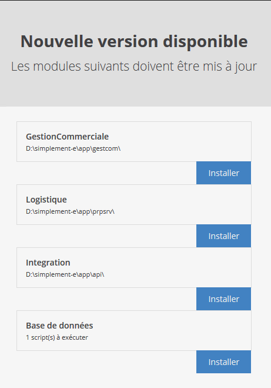
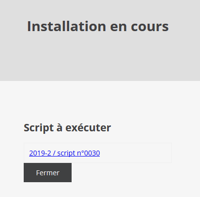
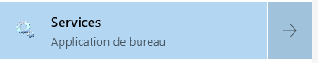
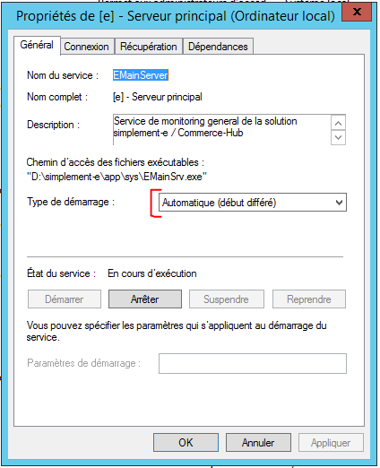
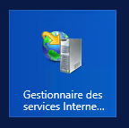
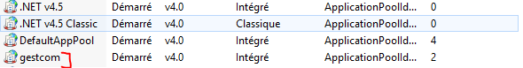

# Installer les mises à jour


Cette procédure décrit comment réaliser l'installation d'une nouvelle version de l'applicatif standard Altazion Office sur un **serveur OnPremise**.

### Cadre d'application

En tant qu'éditeur, nous publions de façon régulière des mises à jour de nos applicatifs. Si la mise à jour est automatique ou réalisée par nos soins pour la version Cloud/SaaS de notre solution, elle doit être réalisée manuellement pour tous les déploiements _OnPremise_, c'est-à-dire pour les serveurs déployés chez un client.
Une partie du travail est automatique : un service Windows, installé avec le reste des produits de la solution, s'occupe de déterminer si l'application est à jour et de télécharger les mises à jour si besoin. Ce service met à disposition un mini portail web permettant de déclencher les mises à jour.

### Opérations à réaliser

1.	Sur chaque serveur OnPremise hébergeant une partie de l'application, ouvrir un navigateur (ne pas utiliser Internet Explorer en mode _restreint_) sur l'url http://localhost:8080/  
2.	Si toutes les applications sont à jour : il n'y a normalement rien à faire. Si il y a une nouvelle version des services, le portail affiche la liste des modules à mettre à jour :

    

    >[!NOTE]
    > Si vous êtes sûr qu'une version est disponible et qu'elle n'est pas accessible, reportez-vous à la section Aucune version n'est disponible ci-dessous.

3.	Informer les utilisateurs qu'une coupure de quelques minutes est à prévoir sur les services qui sont à mettre à jour
4.	Pour chaque service, cliquer sur le bouton Installer correspondant. Dans 99% des cas, il n'y a aucune étape supplémentaire à réaliser : le service de mise à jour déploie automatiquement la nouvelle version et revient à la liste des services.

#### Cas particulier de l'application _Base de données_

Il est possible que l'installation de la partie base de données ne soit pas automatique. Cela signifie que la base de données est personnalisée et que certaines tables, vues ou procédures ont été dénormalisées par rapport à l'application standard. Dans ce cas, le module ne pouvant déterminer quels impacts auront les scripts de mise à jour. 

Dans ce cas, il vous faudra passer les scripts, un par un, sur la base de données après avoir vérifié leur contenu.



### Que faire si ?

#### Le site http://localhost:8080 n'est pas accessible

La cause la plus probable est que le service n?est pas en fonctionnement ou est en erreur.
- Vérifier que le service _[e] - service principal_ (attention, il pourrait être remplacé par un service _Altazion - service principal_) est en fonctionnement sur la machine
- Lancer l'outil d'administration _Services_ 
    
    
      
- Chercher le service en question et regarder son état
- Vérifier le mode de démarrage : il doit normalement être à Automatique (début différé), le modifier si nécessaire.

    

- Démarrer s'il n'est pas en fonction. Si le service refuse de démarrer, on entre dans une procédure de support : nous vous invitons alors à vous rendre sur [support.altazion.com](http://support.altazion.com) et à ouvrir un ticket.
- Si le service était en fonction, utiliser la technique la plus vieille de support IT : l'arrêter et le redémarrer.

#### Aucune version n'est disponible
Pour vérifier qu'une version est disponible pour un applicatif donné, il suffit de comparer la version installée avec la dernière version publiée.

Page présentant la dernière version : https://aide.altazion.com/fr-fr/releasenotes/ 

Si vous avez accès au système de fichier du serveur, le plus simple est de comparer la version visible dans cette page avec la dernière version detectée par le module, que vous pourrez trouver dans : `C:\ProgramData\CPoint\[e]\bin\updates\status.xml `

-	Si ces deux versions diffèrent et que la version est publiée depuis au moins une journée, essayez d'arrêter et de relancer le service en suivant la procédure du point _"Le site http://localhost:8080 n'est pas accessible"_, patientez environ 20 minutes après redémarrage pour laisser le temps au service de récupérer les nouvelles versions.
-	Vérifiez que le fichier de déclaration des applications situé : `C:\ProgramData\CPoint\[e]\bin\config\applicationspath.config` contient des noeuds XML correspondant aux services qui s'exécutent sur le serveur. Si ce n'est pas le cas, il s'agit probablement d'un problème de droits sur le dossier qui empêche les services d'écrire dans ce dossier. Rapprochez vous de l'administrateur système pour déterminer sous quelles identités sont exécutées les applicatifs et donner des droits d'écriture sur ce dossier à toutes ces identités.
-	Si cela ne fonctionne pas, on entre dans une procédure de support [TODO : lien vers la procédure de support à ajouter].

#### L'installation d'une version _boucle_ et ne se fait pas

Lorsque vous lancez l'installation d?une version, l'opération semble se faire mais lors du retour à la page de liste des mises à jour à installer, l'application reste toujours à mettre à jour.

Dans la plupart des cas, ce problème est dû à une trop forte utilisation de l'application pendant sa mise à jour. Bien que nous mettions les applicatifs en _pause_ lors de la mise à  jour, en cas de forte utilisation, le système d'exploitation met parfois plusieurs minutes avant de libérer toutes les ressources. 
-	Avant toutes autres choses, vérifiez qu'aucun explorateur ou ligne de commande n'est ouvert en pointant sur les dossiers applicatifs de la solution, si cela est le cas, fermer ces fenêtres. Pensez à vérifier ce point au travers des multiples utilisateurs éventuellement connectés sur le serveur.
-	Relancer une seconde fois la mise à jour après avoir patienté deux à trois minutes
-	Si cela ne fonctionne toujours pas, pour les applications _web_ :
    - Ecommerce
    - Gestion commerciale
    - Phygital

Vous pouvez arreter le pool d'application dans lequel tourne l'applicatif :

- Lancez l'outil d'administration _gestionnaire des services IIS_ :

    

- Localisez le(s) pool(s) d'application faisant tourner la ou les applications que vous n'arrivez pas à mettre à jour :

    
    
- Cliquez sur Arrêter
- Relancer la mise à jour
- Revenir dans le gestionnaire IIS et redemarrez le(s) pool(s) que vous avez arrêté.

#### Après installation, le site reste "en maintenance"

Cela peut arriver si vous avez fait plusieurs essais d'installation du même module sans succès. Pour corriger ce problème, vous devrez ouvrir le dossier dans lequel est installé l'application qui reste bloquée, et chercher un fichier _app_offline.htm_ (ou .html). Une fois localisé :

- si aucun fichier _app_offline.bak_ n'est présent dans le dossier, renommez le fichier .htm(l) en .bak
- si il y a déjà un fichier .bak, supprimez simplement le fichier .htm(l).

## Configuration avancée

Afin de permettre la personnalisation (par exemple pour ajouter des informations dans les fichiers web.config), il faut ajouter un/des fichier(s) Powershell dans les dossier de configuration. 

Ces fichiers se placent dans le dossier `%PROGRAMDATA%\CPoint\[e]\bin\updates\scripts` et doivent être nommés en fonction du module à installer et de la phase d'installation. Par exemple :

- PREINSTALL_ecommerce.ps1
- POSTINSTALL-phygital.ps1.

Les phases d'installations disponibles sont :

- STARTUPDATE : première étape réalisée avant toute modification du module. Dans le cadre d'un site web, celui-ci n'est pas encore arreté et le App_offline.html n'est pas encore créé.
- PREBACKUP : réalisé juste avant de compresser l'ancienne version pour backup
- POSTBACKUP : appelé juste après la création du backup
- PREINSTALL : déclenché avant la mise en place des nouveaux fichiers
- POSTINSTALL : appelé juste avant la réactivation du module, après copie des fichiers et mise en place des éléments. Dans le cadre d'un module web, le App_offline est toujours actif
- ENDUPDATE : dernière étape, appelé après toutes les opérations de mise à jour.

Les modules :

- gestioncommerciale : la gestion commerciale
- ecommerce : le module e-commerce
- phygitalapi : l'application phygitale (store & signage)
- integration : l'api générale (hub)

Par exemple :
```powershell
# FICHIER : POSTINSTALL_ecommerce.ps1

$rootFolder = (get-item env:E_MODULE_PATH).Value
pushd $rootFolder
$webconfigfile = get-item web.config
[xml]$webconfig = Get-Content($webconfigfile)
$d = $webconfig.SelectSingleNode("/configuration/e")
$d.InnerXml = "<e.env />"
$d = $webconfig.SelectSingleNode("/configuration/e/e.env")
$d.SetAttribute("rootFolder",$rootFolder)
$d.SetAttribute("kind","Release")
$webconfig.Save($webconfigfile.FullName)
popd
```

### Variables d'environnement

Les variables d'environnements suivantes sont définies pour utilisation dans les scripts powershell :

- `E_MODULE_PATH` : le path (terminé par un \\) d'installation du module
- `E_BACKUP_PATH` : le path (terminé par un \\) dans lequel sont sauvegardés les back-ups 
