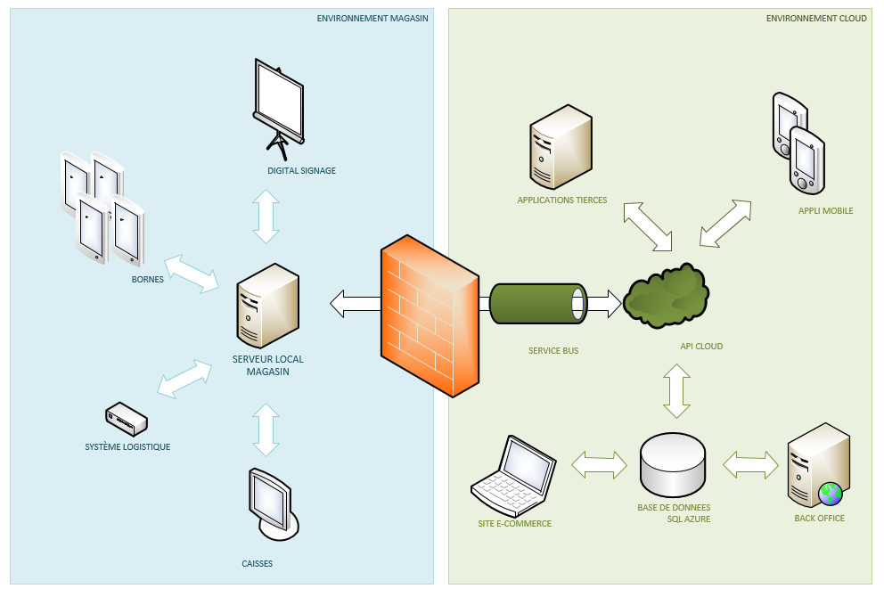
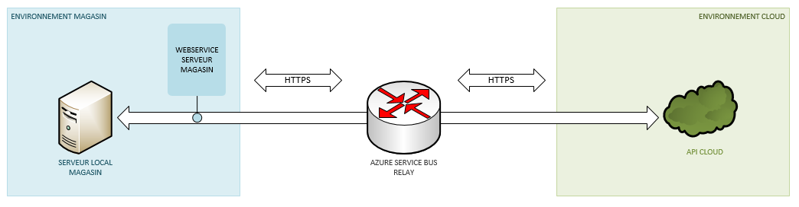

# Architecture technique

## Mode bi-directionnel

Ce mode n'est utilisé que si vous activez les fonctionnalités _cross-canales en temps réel_ de vos caisses ou devices phygitaux.

En activant le mode bi-directionnel, vous permettez au service cloud de réaliser des opérations instantanées dans vos magasins, comme par exemple :

- de réaliser des commandes _click'n'collect_ instantannées, c'est à dire envoyé immédiatement à votre système de préparation logistiques

- d'interroger le _stock réel_ de vos magasins via le cloud

> **L'utilisation du mode bi-directionnel doit être réservée à des processus devant être réalisé en temps réel, sans aucun délai de synchronisation, et, à ce titre, ne doit être activée que si le mode "asynchrone" décrit précédemment ne convient pas.**

Lorsque vous activez le mode bi-directionnel, le serveur local magasin "publie" un point d'accès API au travers d'Azure Service Bus Relay pour le rendre accessible à notre environnement Cloud. L'utilisation de Service Bus Relay permet d'établir une connexion sécurisée entre le serveur se trouvant dans votre magasin et notre environnement Cloud :

* Il n'y a, par défaut, aucun port à ouvrir : toute la communication se fait à l'instigation du serveur magasin et utilise le port 443
* Toutes les communications sont sécurisées via l'utilisation du protocole HTTPS.
* La communication étant établie par le serveur magasin, seules les fonctionnalités nécessaires sont publiées, limitant ainsi la surface d'attaque
* Seuls les clients duement autorisés au sein d'Azure sont susceptibles d'accéder aux services publiées par le magasin.

Pour une liste complète des fonctionnalités mise à disposition via Azure Service Bus Relay, consultez le [détail des communications avec le serveur central](/technique/on-premise/storeserver/fonctionnalites-integration.md).

### Ouvertures de ports.

Pour utiliser le mode bi-directionnel, vous devez ouvrir les ports suivants :

* En sortie : le port 443 en TCP, pour autoriser le flux de données du protocole HTTPS