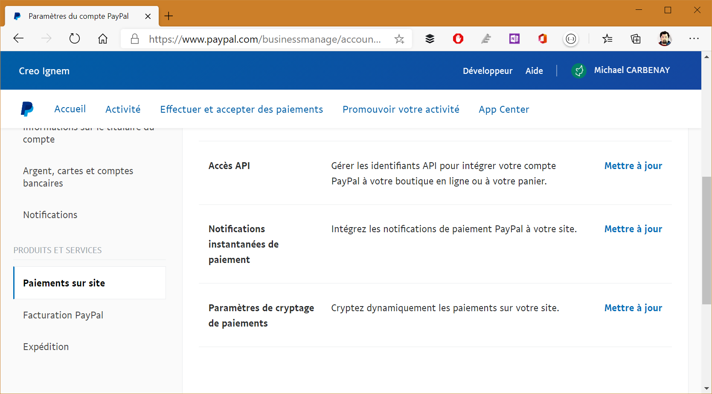

# Intégrer Paypal

## Sécuriser vos échanges

Pour assurer un cryptage optimal entre Paypal et nos solutions, vous devrez créer un certificat et l'enregistrer d'un coté et de l'autre. Cette manipulation est assez complexe, n'hésitez pas à contacter notre support technique pour vous aider à la réaliser.

Pour démarrer, vous aurez besoin de créer un certificat avec l'outil OpenSSL. Vous pouvez télécharger ce dernier ici : https://slproweb.com/products/Win32OpenSSL.html.

Une fois ce programme installé, vous devrez utiliser une ligne de commande pour lancer quelques commandes :

- `genrsa -out cleprivee.pem 1024` : cette commande génère une clé privée RSA de 1024 bits qui est stockée dans le fichier cleprivee.pem.
- `req -new -key cleprivee.pem -x509 -days 365 -out moncertificat.pem` : Cela étape permet de générer un certificat public à l'aide de votre clé privée. Ce certificat aura une durée effective d'un an, mais pourra être utilisé même après son expiration. _Les informations saisies pendant cette phases doivent être renseigné au plus juste pour éviter tout conflit avec Paypal_
- `pkcs12 -export -out certificat.p12 -in moncertificat.pem -inkey cleprivee.pem` : le mot de passe est à conserver pour pouvoir ajouter le fichier dans nos outils et sur paypal.

Une fois cette étape réalisée, le fichier certificat.p12 est à uploader sur Paypal. Pour cela, à partir de votre compte "Paypal Professsionel", rendez vous dans les _Paramètres du compte_ puis dans _Produits et services_ > _Paiements sur site_ :

.

Vous pourrez ensuite _Ajouter_ votre certificat, en faisant attention de choisir le fichier `moncertificat.pem` (ou en adaptant le nom du fichier si vous l'avez renommé).

> [!NOTE]
> Si vous souhaitez de l'aide sur cette partie, notre support technique est à votre disposition.