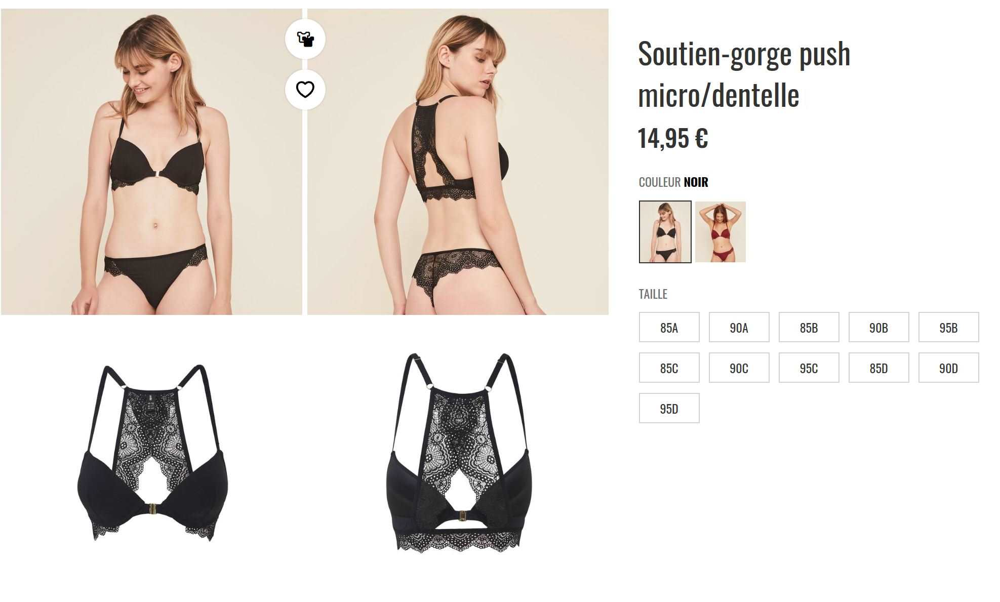
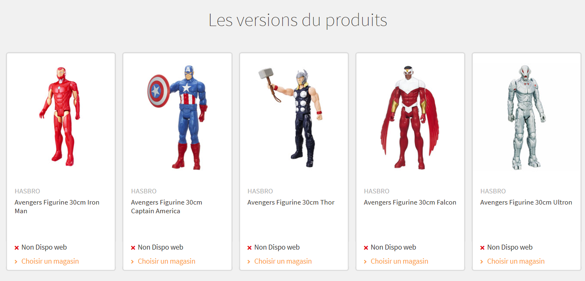

# Articles déclinables

Il est possible d'établir des liaisons "réf-mère/ref-fille" entre articles. C'est par exemple utile pour gérer des produits déclinables en terme de tailles. On a dans ce cas, en plus des produits physiquements vendus, une notion de "modèle" qui chapeaute ces produits. 

Par exemple :

- un pantalon peut être décliné en plusieurs produits pour chaque des tailles
- un figurine peut être décliné en fonction du personnage

L'idée est de pouvoir à la fois établir des relations entre plusieurs produits mais aussi de pouvoir définir des propriétés aussi bien à la ref-mère (au modèle de produit), qu'à la ref-fille (le produit effectivement vendu.)

Prenons l'exemple d'un produit de type vêtement :

Les articles correspondant à ce produit existe en plusieurs tailles, et chacune de ces tailles est un produit vendable, ayant un stock et certaines propriétés, on retrouve donc dans le back-office :

## Créer un produit déclinable

Il existe deux façon de créer des produits déclinables :

1. pour les articles ayant des caractéristique très similaires entre les différentes déclinaisons. Dans ce cas, vous allez créer un article _générique_ pour servir de modèle à toutes les déclinaisons, puis ajouter autant de _versions_ que nécessaires en ne saisissant que les attributs différentiants.
2. Pour les articles qui sont assez différents pour demander des descriptions et des images différentes en fonction de la déclinaison, il vous faudra créer toutes les versions indépendamment puis, éventuellement créer un article simple pour effectuer le regroupement.

### Créer des variations simples

### Créer des articles séparés

Si vos articles sont très différents les uns des autres et doivent présenter une fiche produit individuelles, vous devrez créer chacun d'entre eux de façon indépendante :

