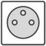
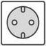

# Alimentation électrique

Vérifiez la présence d'une prise d'alimentation, à proximité de l'endroit d'installation de votre borne / tablette.

- **Vérifiez le type de prise** : sauf demande expresse, nous fournissons des prises au format le plus répandu dans votre pays. Vérifiez aussi qu'une connexion à la terre est présente sur votre prise murale. 

|Prise|Lieu d'utilisation|
|---|---|
| | Union européene|

- **Evitez les multiprises** : nos équipements pouvant inclure des multi-prises, nous vous invitons à brancher directement celui-ci sur une prise murale ou un rail électrique.

- **Vérifiez la distance** : nous fournissons par défaut un câble d'environ 3m de long. Si cette dimensions est trop courte, merci de nous le préciser avant envoi afin que nous puissions vous en fournir un de plus grande longueur.

- **Vérifiez que la prise est sur un réseau électrique non interrompu** : afin de ne pas abîmer prématurément votre équipement, il ne doit pas être branché sur un circuit que vous éteignez en fermant le magasin. Veillez particulièrement à ce qu'il ne soit pas sur le réseau d'éclairage ou de chauffage.

## Pour votre confort

- **placez votre équipement sur une prise protégée** : les dégâts dûs à un problème de tension n'étant que rarement pris en charge par les garanties constructeurs, veillez à placer votre équipement sur un circuit équipé d'une protection contre les variations d'intensité électrique et protégé des risques de surtensions (foudre, variation de tri-phasé, etc.)

- **associez un onduleur** pour limiter l'impact de coupures de courant, nous vous conseillons de protéger votre équipement par un onduleur.