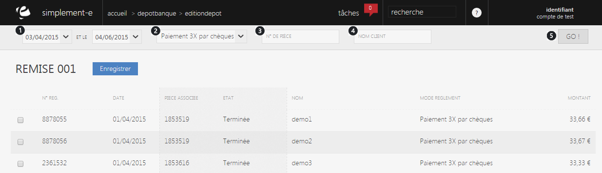

# Modification de remise

Cette page vous permet de <strong>modifier une remise en banque</strong>, vous pouvez visualiser les diff&eacute;rents r&eacute;glement d'un d&eacute;pot ainsi que leurs diff&eacute;rentes informations.

Vous pouvez rechercher&nbsp;un r&eacute;glement&nbsp;via la barre de recherche :

<ol>
<li>La date d'enregistrement,</li>
<li>Le mode de paiement,</li>
<li>Le num&eacute;ro de la&nbsp;pi&egrave;ce,</li>
<li>Le nom du client.</li>
</ol>

Pour lancer la recherche cliquez sur le bouton <strong>Go</strong>. (5)

Vous pouvez modifier&nbsp;votre d&eacute;pot&nbsp;via la case situ&eacute; sur la gauche d'une remise.

Cette case vous permet de faire <strong>apparaitre un r&eacute;glement dans votre d&eacute;pot, </strong>la partie en gras correspond aux &eacute;l&eacute;ments d&eacute;j&agrave; inclus dans votre remise.

&nbsp;

&nbsp;

