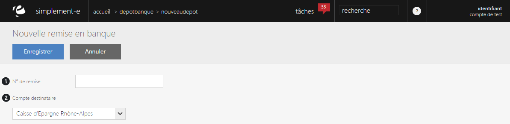

# Création d'une remise

Pour cr&eacute;er une nouvelle remise en banque, cliquez sur la&nbsp;<strong>commande d'action&nbsp;</strong>puis sur <strong>Nouveau</strong>.

Vous serez redirig&eacute; vers un <strong>formulaire d'&eacute;dition</strong> vous permettant de cr&eacute;er une nouvelle remise.

Vous trouverez dans ce formulaire les crit&egrave;res suivant :

<ol>
<li>Le num&eacute;ro de la nouvelle remise,</li>
<li>Le compte destinataire (banque b&eacute;n&eacute;ficiare).</li>
</ol>

Afin de valider votre cr&eacute;ation, cliquez sur le bouton bleu <strong>Enregistrer</strong>.

