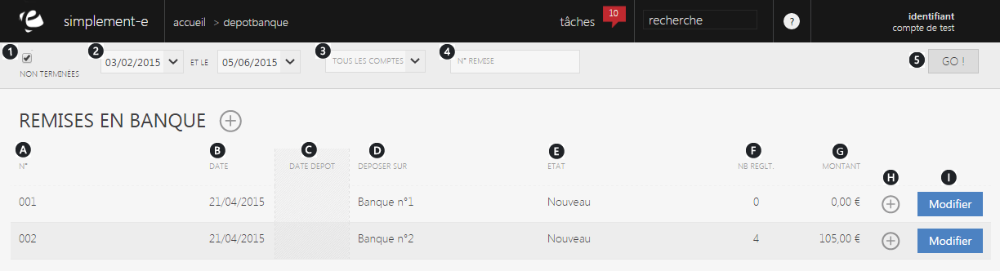

# Recherche de remises

Une remise vous <strong>permet de faire un d&eacute;pot dans une banque</strong>.

Dans cette page, vous retrouverez l'int&eacute;gralit&eacute; de vos d&eacute;pots.

Vous y trouverez :

<ol>
<li>Cette case vous permet d'inclure dans la recherche les remises termin&eacute;es ou non.</li>
<li>La date de cr&eacute;ation,</li>
<li>Les banques b&eacute;n&eacute;ficiaire,</li>
<li>Le num&eacute;ro de remise du d&eacute;pot.</li>
</ol>

Afin de valider votre recherche, cliquez sur le bouton <strong>GO</strong>. (5)

Vous retrouverez tout les d&eacute;pots &eacute;mis &agrave; vos banques.

Vous pourrez voir dans cette page :

<ol type="a">
<li>Le num&eacute;ro de remise,</li>
<li>La date d'enregistrement,</li>
<li>La date du d&eacute;pot,</li>
<li>Le compte b&eacute;n&eacute;ficaire,</li>
<li>L'&eacute;tat de la remise (Nouveau...),</li>
<li>Le nombre de r&eacute;glement,</li>
<li>Le montant de la remise,</li>
<li>Commande d'action vous permettant d'imprimer une remise.</li>
</ol>

Vous pouvez aussi modifier votre remise pour cela, vous devez cliquer sur le lien bleu <strong>Modifier</strong>. (I)

<h3>Actions</h3>

La&nbsp;<strong>commande d'action&nbsp;</strong>que vous pouvez apercevoir pr&egrave;s du titre, correspond au menu de commande.

Il vous permet d'acc&eacute;der &agrave; diff&eacute;rentes actions qui vous permettront de g&eacute;rer votre activit&eacute;.

<em>Exemple&nbsp;</em>de commande que vous pouvez avoir :

<table>
<tbody>
<tr>
<td><a href="/fr-fr/office/gestion-commerciale/Financier/DepotBanque/NouveauDepot.html">Nouveau</a></td>
<td>&nbsp;Cette action vous permet de cr&eacute;er une nouvelle remise en banque</td>
</tr>
</tbody>
</table>

