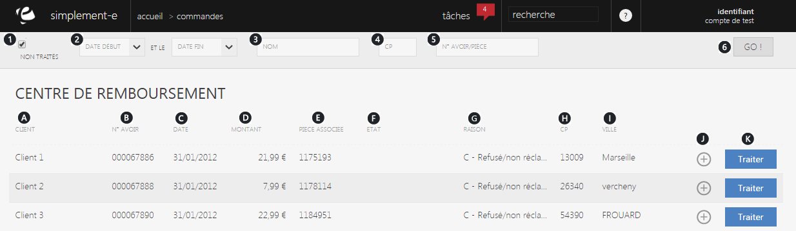

# Recherche

Le centre de remboursement vous permet de <strong>visualiser et de traiter les diff&eacute;rents avoirs des clients pour &eacute;tablir un remboursement.</strong>

De cette page, vous pouvez rechercher et traiter un remboursement.

<h3>Rechercher un avoir</h3>

Vous pouvez lancer une recherche avec les crit&egrave;res suivants :

<ol>
<li>Case permettant de choisir les remboursements trait&eacute;s ou non-trait&eacute;s,</li>
<li>La date de d&eacute;but et de fin du remboursement,</li>
<li>Le nom du client,</li>
<li>Son code postal,</li>
<li>Son num&eacute;ro d'avoir.</li>
</ol>

Pour lancer la recherche, cliquez sur le bouton <strong>GO</strong>. (6)

<h3>Avoirs</h3>

Cette page vous donne acc&egrave;s &agrave; <strong>l'int&eacute;gralit&eacute; des avoirs de vos clients</strong>.

Vous pouvez avoir les informations suivantes :

<ol type="a">
<li>Le nom du client,</li>
<li>Le num&eacute;ro de l'avoir,</li>
<li>La date du remboursement,</li>
<li>Son montant,</li>
<li>L'article associ&eacute;,</li>
<li>Son &eacute;tat (valid&eacute;, termin&eacute;, en cour de traitement..),</li>
<li>La raison du remboursement,</li>
<li>Le code postal du client,</li>
<li>Sa ville.</li>
</ol>

Vous pouvez aussi mettre le remboursement sur un <strong>encours via le menu d'action</strong> (J).

Pour traiter votre remboursement, cliquez sur le bouton bleu "<strong>Traiter</strong>". (K)

&nbsp;

