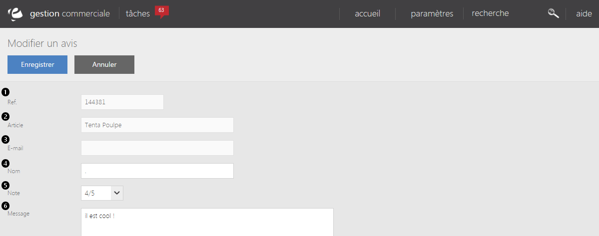

# Modifier un avis

Dans cette page, vous trouverez le formulaire qui vous permet de <strong>modifier un avis client</strong>.

Dans ce formulaire, vous pouvez voir les diff&eacute;rentes caract&eacute;ristiques d'un avis, comme :

<ol>
<li>La r&eacute;f&eacute;rence du produit,</li>
<li>Son libell&eacute;,</li>
<li>L'e-mail du client r&eacute;dacteur,</li>
<li>Son nom,</li>
<li>La note donn&eacute;e au produit,</li>
<li>Le message qui r&eacute;sume la note.</li>
</ol>

En tant qu'administrateur,<strong> vous ne pouvez modifier que la partie message</strong> afin de <strong>corriger</strong> les <strong>&eacute;ventuelles fautes orthographique</strong>.

Le sens et l'id&eacute;e g&eacute;n&eacute;rale du message ne doit en aucun cas changer lors de la correction.

Vous pouvez par la m&ecirc;me occasion contr&ocirc;ler les caract&egrave;res injurieux qui peuvent appara&icirc;tre dans un avis.

Pour terminer votre correction, cliquez sur <strong>Enregistrer</strong>.

