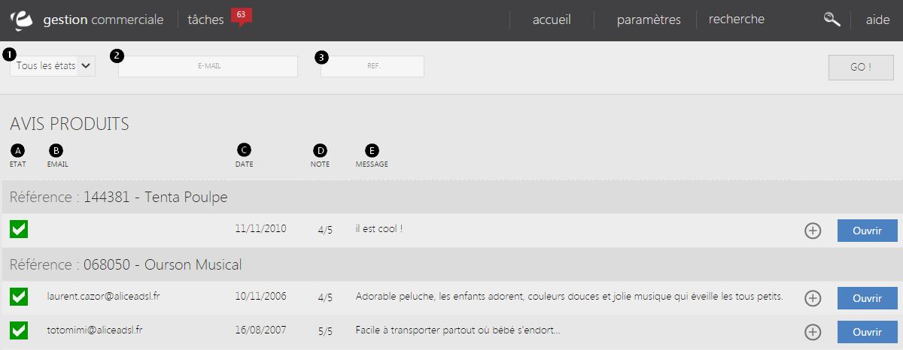

# Avis produits

Dans cette page, vous trouverez **les différents avis rédigés par votre clientèle**.

Il existe deux modes d'avis:

* Le mode **classique**, qui correspond à un mode de correction (orthographique etc) d'un avis client.
* La **norme française**, (norme conseillé) correspond à un mode permettant d'instaurer une relation de confiance avec la clientèle (répondre aux clients), de contrôler les avis insultants ou tout autres caractères injurieux. 

### Rechercher un avis

Vous êtes en mesure de rechercher un avis en particulier en utilisant la barre de recherche située sur le haut de la page.

Pour ce faire vous devez remplir les différents critères demandés tels que :

1.  L'état de l'avis (validé ou non),
2.  L'e-mail du client qui a rédigé l'appréciation.
3.  La référence du produit apprécié.

Pour lancer la recherche, il vous suffira de cliquer sur **Go**.

> A savoir: pour visualiser l'ensemble des avis, cliquez directement sur Go.

### Vos avis

Après avoir lancé votre recherche, les avis clients s'afficheront sur la page, vous pouvez voir :

1.  L'état de l'avis (validé ou non),
2.  L'e-mail du client qui a rédirigé l'avis,
3.  Sa date de publication,
4.  La note donnée au produit,
5.  Le message expliquant la note.

Par la même occasion, vous pouvez **refuser** un avis en expliquant dans un e-mail pourquoi il ne sera pas publié, ou **approuver** via la **commande d'action à droite d'un avis.**

Vous êtes en mesure de **modifier** un avis selon les normes en vigueur, pour cela, il vous suffit de cliquer sur [Ouvrir](/fr-fr/office/gestion-commerciale/Internet/Avis/EditerAvis.html).