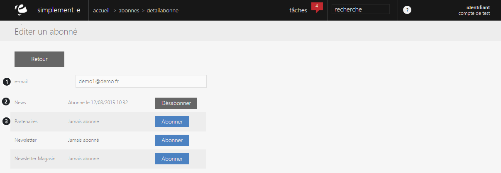

# Détails

Cette page vous permet de <strong>visualiser les d&eacute;tails de l'abonnement d'un client</strong>.

Dans cette page, vous pouvez voir les <strong>diff&eacute;rents abonnement de votre client</strong> ainsi que leurs <strong>dates de d&eacute;but.</strong>

Vous pouvez voir dans cette page :

<ol>
<li><strong>L'e-mail du client</strong>,</li>
<li><strong>Son/ses abonnement</strong>(s),</li>
<li>La liste de vos <strong>diff&eacute;rents partenaires</strong> (vous pouvez voir si votre client c'est abonn&eacute; &agrave; eux ou non).</li>
</ol>

De cette page, vous pouvez <strong>d&eacute;sabonner votre client</strong> &agrave; une newsletter qu'il suivait d&eacute;j&agrave; ou <strong>l'abonn&eacute; &agrave; diff&eacute;rentes newsletters</strong> (les votres ou celles de vos partenaires).

Lorsque vous cliquez sur le bouton gris "<strong>D&eacute;sabonner</strong>", votre client sera instantan&eacute;ment d&eacute;sabonner de la newsletter.

Si vous cliquez sur le bouton bleu "<strong>Abonner</strong>", le client sera automatiquement abonn&eacute; &agrave; la newsletter.

