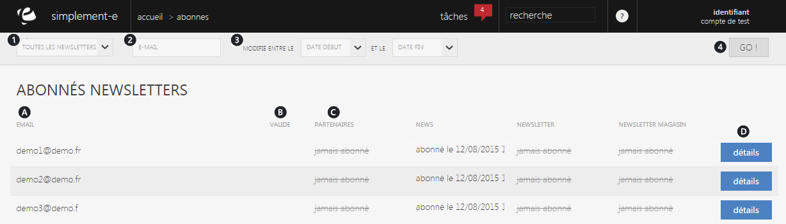

# Recherche d'abonnés

Cette page vous permet de visualiser les abonn&eacute;s newsletters de votre magasins ou site e-commerce.

De cette page, vous pouvez <strong>rechercher un abonn&eacute; ou encore visualiser les informations de certains</strong>.

<h3>Rechercher un abonn&eacute;</h3>

Vous pouvez lancer une recherche avec les crit&egrave;res suivant :

<ol>
<li>Listes d&eacute;roulantes de toutes les newsletters &agrave; suivre,</li>
<li>L'e-mail du client,</li>
<li>Les dates de modifications</li>
</ol>

Pour lancer la recherche, cliquez sur le bouton <strong>GO</strong>. (4)

<h3>Vos abonn&eacute;s</h3>

Vous aurez <strong>acc&egrave;s &agrave; l'int&eacute;gralit&eacute; des abonn&eacute;s de vos newletters</strong>.

Vous pouvez avoir les informations suivantes :

<ol type="a">
<li>L'e-mail du client abonn&eacute;,</li>
<li>La validit&eacute; de son abonnement.</li>
</ol>

Vous pouvez aussi voir les diff&eacute;rents abonnements de vos clients &agrave; des newsletters :

c. Listes des diff&eacute;rentes newsletters (partenaire et les votres)

Pour afficher le d&eacute;tail de l'abonnement, cliquez sur le bouton bleu "<a href="/fr-fr/office/gestion-commerciale/Internet/abonn%C3%A9snewsletters/DetailAbonne.aspx">D&eacute;tail</a>". (D)

&nbsp;

&nbsp;

