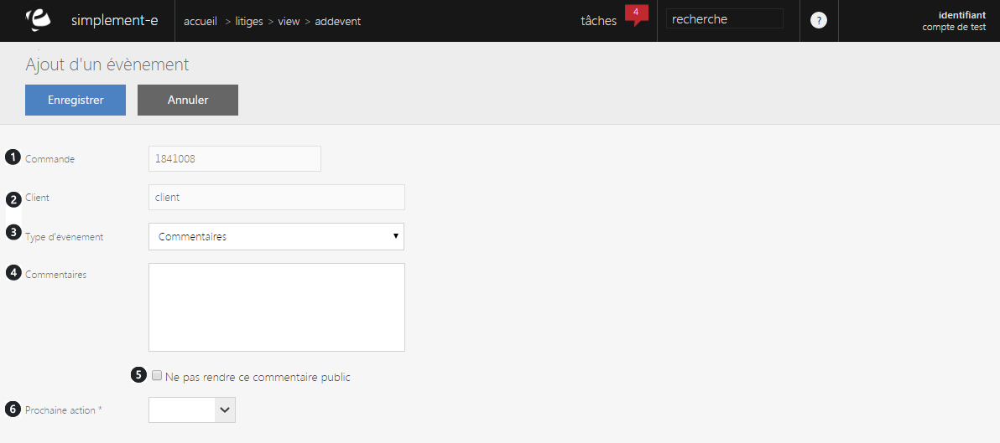

# Ajout d'un événement

Ce formulaire vous permet <strong>d'ajouter un &eacute;v&eacute;nement</strong>.

Pour cela, vous devez remplir les crit&egrave;res suivants :

<ol>
<li>Le num&eacute;ro de la commande sur laquel l'&eacute;v&eacute;nement doit &ecirc;tre fait,</li>
<li>Le nom du client,</li>
<li>Le type d'&eacute;v&eacute;nement (commentaires, envoi d'e-mail, appel t&eacute;l&eacute;phonique),</li>
<li>Le commentaire de l'&eacute;v&eacute;nement,</li>
<li>La case permettant de rendre le commentaire public ou non,</li>
<li>La date de la prochaine action.</li>
</ol>

Pour terminer votre ajout, cliquez sur le bouton bleu <strong>Enregistrer</strong>.

