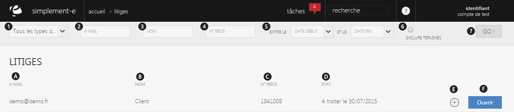

# Litiges 

Un litige correspond &agrave; un <strong>probl&egrave;me li&eacute; &agrave; une commande avec un client</strong>.

Dans cette page, vous retrouverez<strong> l'int&eacute;gralit&eacute; de vos litiges li&eacute;s avec vos commandes</strong>.

Vous pouvez rechercher un litige via la barre de recherche situ&eacute; sur le haut de la page.

<h3>Rechercher un bon d'achat</h3>

Vous pouvez lancer une recherche avec les crit&egrave;res suivants :

<ol>
<li>Les types de litiges (impay&eacute;s, pas valid&eacute;...),</li>
<li>L'e-mail du client,</li>
<li>Son nom,</li>
<li>Le num&eacute;ro de l'article,</li>
<li>La date de cr&eacute;ation et de fin du litige,</li>
<li>Case permettant d'inclure les litiges termin&eacute;s.</li>
</ol>

Afin de lancer votre recherche, cliquez sur le bouton <strong>Go</strong>. (7)

Vos litiges s'afficheront au milieur de votre page, vous pourrez <strong>visualiser l'ensemble de vos litiges</strong>.

Vous pouvez voir dans cette page :

<ol type="a">
<li>L'e-mail du client,</li>
<li>Son&nbsp;nom,</li>
<li>Le num&eacute;ro de la commande,</li>
<li>Son &eacute;tat (&agrave; traiter, terminer...) et sa date,</li>
<li>Menu d'action permettant de voir l'article.</li>
</ol>

Vous pouvez acc&eacute;der aux informations de votre litige, pour cela, vous devez cliquez sur le bouton bleu "<strong>Ouvrir</strong>". (F)

&nbsp;

&nbsp;

