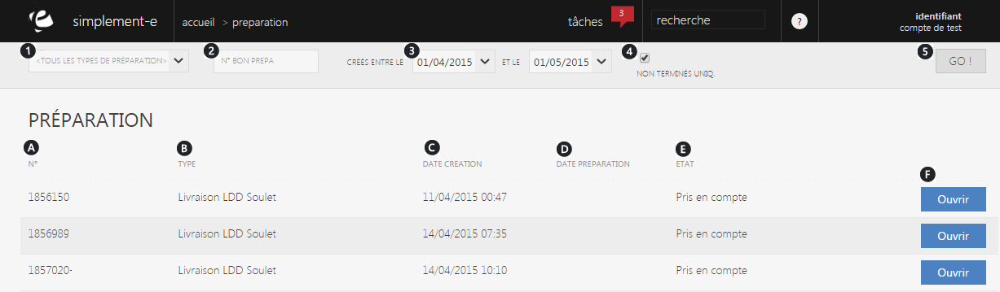

# Vos préparations

Une saisie de pr&eacute;paration vous permet de&nbsp;<strong>visualiser et de traiter les diff&eacute;rents bons de pr&eacute;parations des clients</strong>.

De cette page, vous pouvez rechercher et traiter un remboursement.

<h3>Rechercher une saisie</h3>

Vous pouvez lancer une recherche avec les crit&egrave;res suivant :

<ol>
<li>Les types de pr&eacute;parations,</li>
<li>Le num&eacute;ro du bon,</li>
<li>Sa date de cr&eacute;ation (cr&eacute;&eacute;e entre le... et le...),</li>
<li>Case permettant de rechercher les non termin&eacute;s uniquement.</li>
</ol>

Pour lancer la recherche, cliquez sur le bouton&nbsp;<strong>GO</strong>. (5)

<h3>Saisie de pr&eacute;paration</h3>

Cette page vous donne acc&egrave;s &agrave;&nbsp;l'int&eacute;gralit&eacute; des saisies.

Vous pouvez avoir les informations suivantes :

<ol type="a">
<li>Le num&eacute;ro du bon,</li>
<li>Le type de pr&eacute;paration,</li>
<li>Sa date de cr&eacute;ation,</li>
<li>Sa date de pr&eacute;paration,</li>
<li>Son &eacute;tat.</li>
</ol>

Pour traiter votre bon de pr&eacute;paration, cliquez sur le bouton bleu "<a href="/fr-fr/office/gestion-commerciale/Logistique/SaisiedePreparation/saisieprepaexterne.aspx">Ouvrir</a>". (J)

