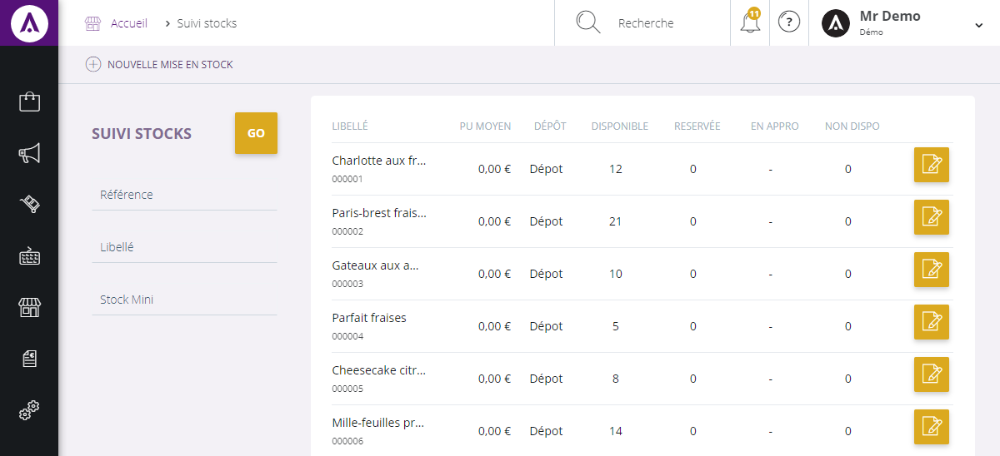

# Vos stocks

Dans cette page, vous retrouverez l**'intégralité de vos produits** présent dans votre **stocks**.

Vous pouvez rechercher un article issu de votre stock via la barre de recherche situé sur le haut de la page.

## RECHERCHER UN ARTICLE

Vous pouvez lancer une recherche avec les critères suivants :

1.  La référence du produit,
2.  Son libellé,
3.  Le nombre d'article recherché présent dans le stock.

Afin de lancer votre recherche, cliquez sur le bouton **Go**. 

Votre stock s'affichera au milieur de votre page, vous pourrez visualiser l'ensemble de votre stock.

Dans cette page, vous pouvez voir :

1.  La référence de l'article,
2.  Son libellé,
3.  Son prix unitaire moyen,
4.  Son emplacement (stock),
5.  Sa disponibilité,
6.  Le nombre d'article réservé,
7.  Son approvisionement.

Vous pouvez accéder aux informations de votre stock article, pour cela, vous devez cliquer sur le bouton bleu "**Ouvrir**".