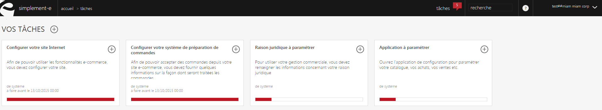

# Vos tâches

Cette page vous permet de visualiser&nbsp;l'int&eacute;gralit&eacute; de vos <strong>t&acirc;ches</strong>, de les&nbsp;<strong>cr&eacute;er&nbsp;</strong>et <strong>g&eacute;rer</strong>.

Vous pouvez <strong>cr&eacute;er</strong> une nouvelle&nbsp;t&acirc;che ou <strong>visualiser les t&acirc;ches envoy&eacute;s&nbsp;</strong>via la <strong>commande d'actions</strong>.&nbsp;

<h3>ACTIONS</h3>

La&nbsp;<strong>commande d'action</strong>&nbsp;que vous pouvez apercevoir pr&egrave;s du titre, correspond au menu de commande. Il vous&nbsp;permet d'acc&eacute;der &agrave; diff&eacute;rentes actions qui vous permettront de g&eacute;rer vos articles.

<em>Exemple&nbsp;</em>de commande dont vous pouvez disposer :

<table>
<tbody>
<tr>
<td><strong>&nbsp;T&acirc;ches envoy&eacute;es&nbsp;</strong></td>
<td>&nbsp;Permet de visualiser l'ensemble des t&acirc;ches envoy&eacute;es &agrave; vos collaborateurs</td>
</tr>
<tr>
<td><strong>&nbsp;Nouvelle t&acirc;che</strong></td>
<td>&nbsp;Permet de cr&eacute;er une nouvelle t&acirc;che&nbsp;</td>
</tr>
</tbody>
</table>

