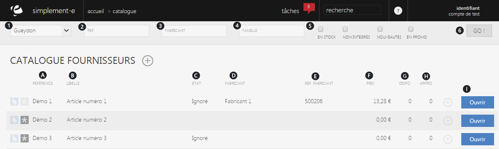

# Recherche et intégration

Le <strong>catalogue fournisseur</strong> vous permet de <strong>visualiser</strong> les <strong>produits de votre fournisseur</strong> et ainsi les <strong>int&eacute;grer</strong> &agrave; votre propre catalogue produit.

De cette page, vous pouvez rechercher un article dans le catalogue de votre fournisseur o&ugrave; encore de les int&eacute;grer dans votre catalogue.

<h3>Rechercher un article dans le catalogue fournisseur</h3>

Vous pouvez lancer une recherche avec les crit&egrave;res suivant :

<ol>
<li><strong>Listes des enseignes</strong> proposant le produit recherch&eacute;,</li>
<li>La <strong>r&eacute;f&eacute;rence du produit,</strong></li>
<li>Le <strong>nom du fabricant,</strong></li>
<li>La <strong>famille</strong> du produit,</li>
<li>Cases &agrave; cocher :</li>
</ol>

&nbsp; - En <strong>stock</strong>,

&nbsp; - <strong>Int&eacute;gr&eacute;</strong> dans votre catalogue ou non,

&nbsp; - Si le <strong>produit est nouveau</strong>,

&nbsp; - S'il est en <strong>promotion</strong>.

Pour lancer la recherche, cliquez sur " <strong>GO</strong> " (6)

Ces crit&egrave;res vous permettront de rechercher un article rapidement en saisissant les informations dont vous disposez.

<h3>Articles fournisseurs</h3>

Cette page vous donne acc&egrave;s &agrave; <strong>l'in&eacute;gralit&eacute; des articles de vos fournisseurs</strong>, elle vous permet de les <strong>int&eacute;grer</strong> &agrave; votre catalogue ou de <strong>visualiser</strong> les informtions du produit.

Les articles fournisseurs sont tri&eacute;s selon leur r&eacute;f&eacute;rence, chaque ligne repr&eacute;sente un article issu de son catalogue produit.

Vous pouvez avoir les informations suivantes :

<ol type="a">
<li>La <strong>r&eacute;f&eacute;rence</strong> de l'article,</li>
<li>Son <strong>lib&eacute;ll&eacute;</strong>,</li>
<li>Son <strong>&eacute;tat </strong>(validation du produit),</li>
<li>Le <strong>nom du fabricant</strong>,</li>
<li>La <strong>r&eacute;f&eacute;rence du fabricant</strong>,</li>
<li>Le <strong>prix</strong> du produit,</li>
<li>Sa <strong>disponibilit&eacute;</strong>,</li>
<li>Son <strong>approvisionnement</strong> en cour.</li>
</ol>

Pour acc&egrave;der au information d'un article du fournisseur, cliquez sur le lien bleu " <strong>Ouvrir</strong> " (I)

<h3>Actions</h3>

La commande d'action&nbsp;que vous pouvez voir pr&egrave;s du titre, correspond au menu de commande.

Il vous permet d'acc&eacute;der &agrave; diff&eacute;rentes actions.

<em>Exemple</em>:

<table style="height: 49px;" width="602">
<tbody>
<tr>
<td><a href="/helpadmin/ViewTopic.aspx?action=edit&amp;thlguid=0107fff5-499b-495a-aab0-b0a8202455b4">Int&eacute;grer</a></td>
<td>

&nbsp;Cette action va donc vous permettre d'int&eacute;grer un article fournisseur &agrave; votre porpre catalogue.

</td>
</tr>
</tbody>
</table>

