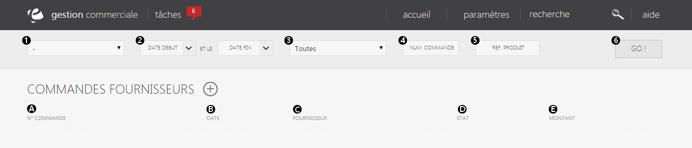
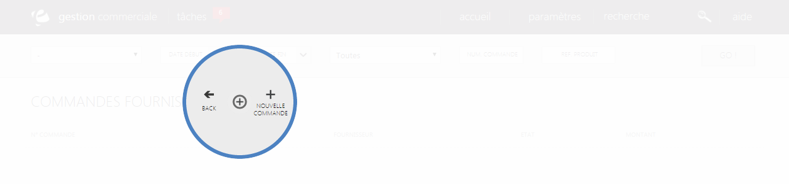

# Recherche et création d'une commande

La <strong>commande fournisseur</strong> va vous permettre de <strong>passer directement une commande aupr&egrave;s de votre fournisseur</strong>.

Vous pouvez <strong>rechercher</strong> une commande que vous avez d&eacute;j&agrave; faite ou en <strong>cr&eacute;er</strong> une nouvelle.

<h3>Recherche d'une commande</h3>

Vous pouvez lancer une recherche de commande gr&acirc;ce aux cit&egrave;res suivant :

<ol>
<li><strong>Barre d&eacute;roulante montrant les diff&eacute;rents fournisseurs,</strong></li>
<li><strong>Date</strong> de <strong>d&eacute;but</strong> et de <strong>fin</strong> de la commande,</li>
<li><strong>Recherche approfondit</strong> de la commande (recherche seulement les nouvelles commandes, les termin&eacute;s, les en cours...),</li>
<li>Son <strong>num&eacute;ro,</strong></li>
<li>Sa <strong>r&eacute;f&eacute;rence.</strong></li>
</ol>

Pour lancer la recherche, cliquez sur le bouton "<strong>GO</strong>". (6)

<h3>Commandes fournisseurs</h3>

Cette page vous donne acc&egrave;s &agrave; <strong>l'int&eacute;gralit&eacute; de vos commandes fournisseurs</strong>, elle vous permet de visualiser les produits que vous avez commander aupr&egrave;s de votre fournisseur.

Les commandes sont tri&eacute;es selon leur num&eacute;ro de commande, chaque ligne correspond &agrave; une commande faite aupr&egrave;s d'un fournisseur.

Vous pouvez avoir les informations suivantes :

<ol type="a">
<li>Le <strong>num&eacute;ro de commandes</strong>,</li>
<li>Sa <strong>date</strong>,</li>
<li>Le no<strong>m de son fournisseur</strong>,</li>
<li>Son <strong>&eacute;tat</strong>,</li>
<li>Le <strong>montant de cette commande</strong>.</li>
</ol>

Pour acc&eacute;der aux informations d'une commande, cliquez sur le lien bleu "<strong>Ouvrir</strong>".&nbsp;

<h3>Actions</h3>

Le que vous pouvez voir pr&egrave;s du titre, correspond au menu de commande.

Il vous permet d'acc&eacute;der &agrave; diff&eacute;rentes actions.

<em>Exemple :</em>

<table>
<tbody>
<tr>
<td><strong><a href="/fr-fr/office/gestion-commerciale/achats/commandesfournisseurs/formualiredecommandefournisseur.aspx">Nouvelle commande</a> </strong></td>
<td>Cette action vous permet&nbsp;de commander des produits directement chez&nbsp;votre fournisseur.</td>
</tr>
</tbody>
</table>
<h3>Cr&eacute;er une nouvelle commande</h3>

Pour cr&eacute;er une nouvelle commande, cliquez sur le menu&nbsp;puis sur "<strong>Nouvelle commande</strong>".

Lorsque vous choisirez <strong>nouvelle commande</strong>, vous serez redirig&eacute; vers un <strong>formulaire</strong> vous permettant de d&eacute;buter la cr&eacute;ation de la nouvelle commande fournisseur.

