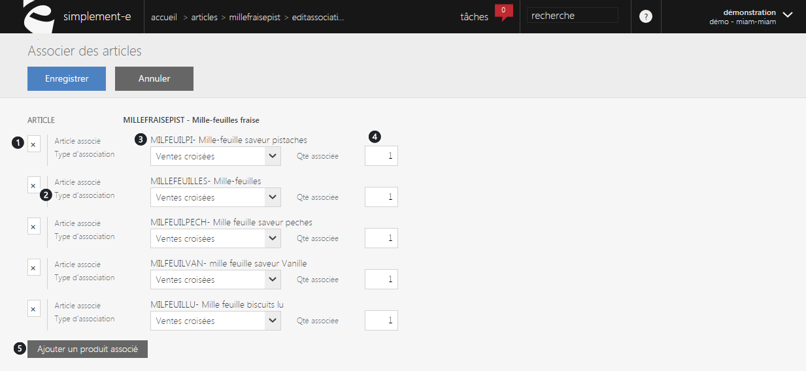

# Formulaire article associé

<blockquote>

A savoir : les crit&egrave;res de modifications sont param&egrave;trables

</blockquote>

<h2>Formulaire de modification de produits associ&eacute;s&nbsp;&nbsp;</h2>

Ce formulaire vous permettra de d&eacute;finir les articles que vous souhaitez <strong>associer</strong> &agrave; votre produit ainsi que son type <strong>d'association</strong> (Upselling, Cross selling, articles compl&eacute;mentaires, articles parents etc&hellip;)

<blockquote>

A savoir : Upselling correspond aux articles &eacute;tant de gamme plus &eacute;lev&eacute;. Cross selling correspond quant &agrave; lui &agrave; des ventes crois&eacute;s ou des ventes additionnelles. &nbsp;

</blockquote>

Ce formulaire vous permet d'associer des articles au votre. Un article associ&eacute; peut correspondre &agrave; plusieurs choses :

- un article <strong>similaire</strong>,

- un article <strong>compl&eacute;mentaire,</strong>

- <strong>diff&eacute;rente version</strong> d'un article<strong>,</strong>

- etc...

Ce formulaire comprend :

<ol>
<li>Lien de <strong>suppression</strong> de l'article associ&eacute;,</li>
<li><strong>Libell&eacute;</strong> et <strong>r&eacute;f&eacute;rence</strong> de ce produit,</li>
<li>Le <strong>types d'association</strong> (similaires, compl&eacute;mentaires etc...),</li>
<li>La <strong>quantit&eacute; associ&eacute;,</strong></li>
<li><strong>Ajout d'un article associ&eacute;.</strong></li>
</ol>

&nbsp;

