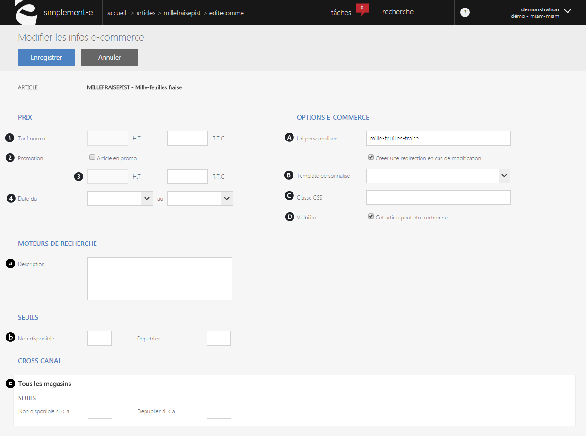

# Formulaire edition e-commerce

Ce formualire va vous permettre de <strong>modifier les informations e-commerce</strong> de votre article.

Vous pouvez :

<strong>- Red&eacute;finir les informations descriptifs du produit</strong>,

- <strong>Modifier le prix de l'article</strong>,

- <strong>R&eacute;&eacute;diter les donn&eacute;es du site e-commerce</strong>.

<h3>Modification du prix d'un article e-commerce</h3>

La premi&egrave;re partie de ce formulaire vous permet de <strong>modifier le prix d'un article e-commerce</strong> (prix HT et TTC) ou encore d'y <strong>inclure une promotion</strong>.

Vous pouvez voir dans cette premi&egrave;re partie les crit&egrave;res suivant :

<ol>
<li>Le<strong> tarif normal HT</strong> et <strong>TTC</strong> (c&rsquo;est-&agrave;-dire sans promotion),</li>
<li>Une <strong>case &agrave; cocher afin d'activer</strong> ou <strong>d&eacute;sactiver une promotion</strong>,</li>
<li>Le <strong>prix HT</strong> et <strong>TTC de la promotion</strong>,</li>
<li>Les <strong>dates d'applications</strong>.</li>
</ol>
<h3>Options e-commerce et moteur de recherche</h3>

Option e-commerce vous permet de <strong>modifier les caract&eacute;ristiques physiques</strong> de l'article ainsi que <strong>d'optimiser sa recherche sur les diff&eacute;rents moteurs de recherche</strong>.

<ol type="a">
<li><strong>URL personnalis&eacute;e</strong>, optimise la recherche via les moteurs de recherche.</li>
<li><strong>Template personnalis&eacute;,</strong> correspond aux modifications de la pr&eacute;sentation de l'article sur le site e-commerce.</li>
<li><strong>Classe CSS</strong>, crit&egrave;re de modification du produit sur le site e-commerce.</li>
<li><strong>Visibilit&eacute; sur le net.</strong></li>
</ol>

Vous pouvez <strong>d&eacute;crire</strong> l'article e-commerce afin de <strong>faciliter</strong> <strong>sa segmentation</strong> via le moteur de recherche.

Ou encore pr&eacute;ciser si l'article est <strong>disponible</strong> et <strong>visible</strong> sur le site e-commerce.

<strong>&nbsp;&nbsp;&nbsp;&nbsp;&nbsp;&nbsp;</strong>c.<strong>&nbsp;&nbsp;Description du produit en ligne.</strong>

<h3>Seuils de disponibilit&eacute; et de visibilit&eacute;</h3>

<strong>Seuils, </strong>vous permet de savoir su votre produit est disponible ou non :

&nbsp;&nbsp;&nbsp;&nbsp;&nbsp;&nbsp;&nbsp;&nbsp;&nbsp;&nbsp; -&nbsp; <em>Non-disponible, </em>correspond &agrave; la quantit&eacute; minimum du stock pour un achat.

&nbsp;&nbsp;&nbsp;&nbsp;&nbsp;&nbsp;&nbsp;&nbsp;&nbsp;&nbsp; - <em>D&eacute;publier,</em> stock minimum avant la d&eacute;publication de l'article sur le site e-commerce.

