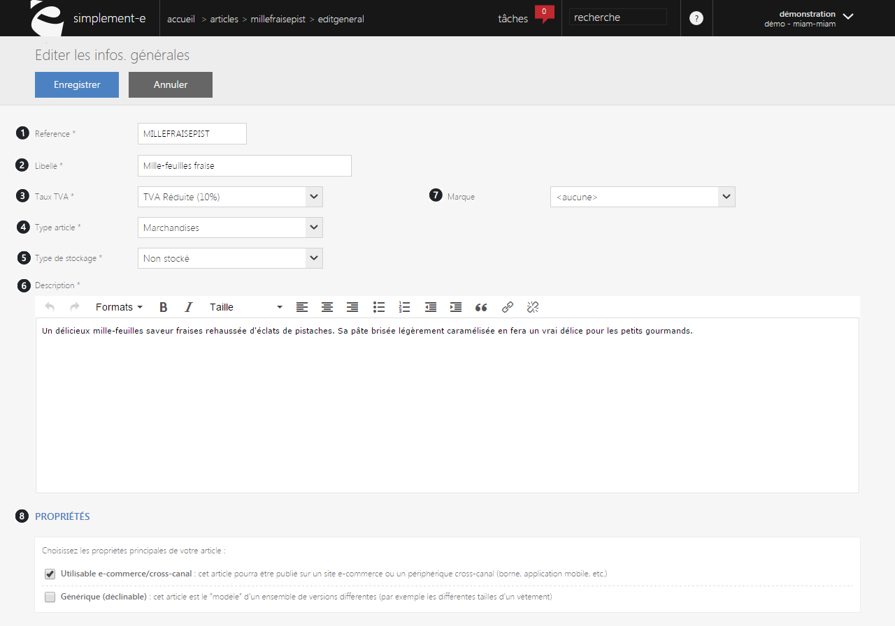
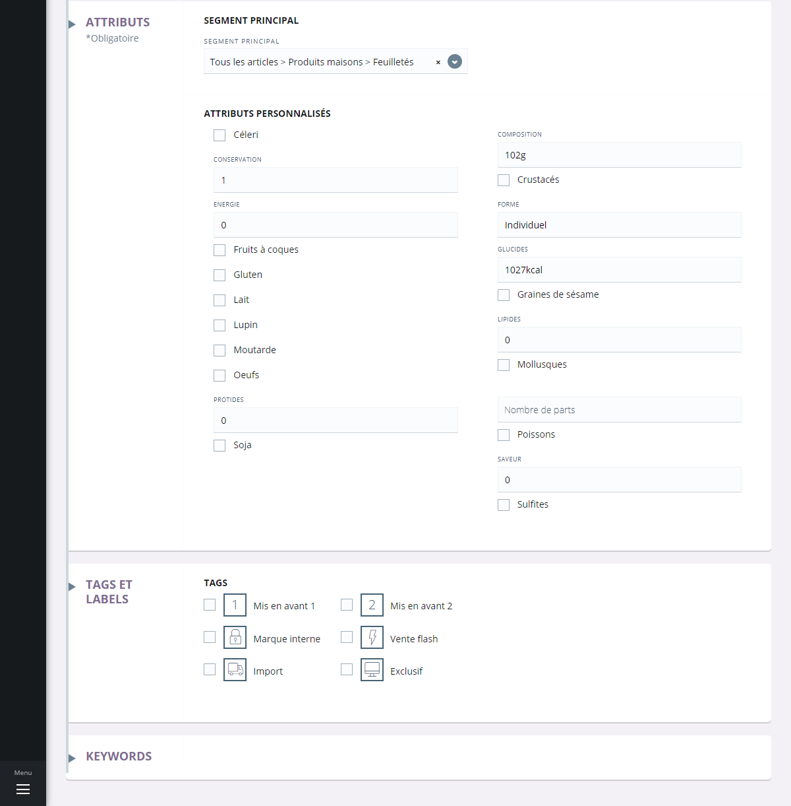

# Modifier les infos. générales

Ce formulaire va vous permettre de **modifier les informations générales** de votre article grâce à trois points distinct :

* **Modification générale** (référence, type d'article, type de stockage etc)
* **Attributs** (segmentation, code EAN)
* **Tags et labels** (mise en avant de l'article)

Modification générale et propriété
----------------------------------

Cette première partie du formulaire vous permettra de **modifier les informations générales d'un article** (description, famille, marque etc...) qui vous permettront de présenter votre produit ou encore définir son rôle.

Vous pouvez voir dans cette première partie de ce formulaire :

1.  **Réference de l'article**
2.  **Le libéllé**
3.  **Le taux de TVA**
4.  **Le type d'articles** (plusieurs proposition si votre articles appartient au types : marchandises, service etc...)
5.  **Types de stockage** (définit comment votre article peut être stocké, ex:stock valorisé au PUMP)
6.  **Une description** (vous pouvez personnaliser votre déscription avec quelques options de mise en forme telles que la couleurs,la taille du texte,ect...)
7.  **La marque** (KINDER, FERERRO...),
8.  **Un ensemble de propriété permettant de modifier le rôle de votre** **article**.

\- _Utilisable e-commerce_ : rend votre article publiable et visible sur votre site e-commerce.

\- _Article générique_ : défini votre article comme étant un " modèle ", pouvant être décliné en plusieurs versions (taille, coloris etc...)

Attributs, tags et labels
-------------------------

La seconde parties du formulaire consiste à modifier les attributs et le rôle de votre produit.

### Le risque

Lorsqu'un produit est à risque, il faut une validation de commande pour que le client puisse continuer son achat. (1)

### Les attributs

Les attributs correspondent aux critères permettant de retrouver un article via certains éléments, vous pouvez avoir : (2)

**\- Segement principal**, l'ordre dans lequel vous pouvez retrouver votre article.

**\- Code EAN e-commerce**, c'est le code barre de l'article.

**\- Garantie du produit,**

**\- Matière de fabrication** (plastique, polymère etc...).

**\- Type de produit** (utilisation, descriptif).

### Tags et labels

Les tags et labels ont le rôle de mettre en avant votre produit et de fournir des informations supplémentaires : (3)

\- **Un tag** correspond à la mise en avant d'un article (promotion, vente flash, vente exclusif etc...).

\- **Un label** correspond à une information supplémentaire (fabriqué en .. etc).

> A savoir : les critères sont paramètrables