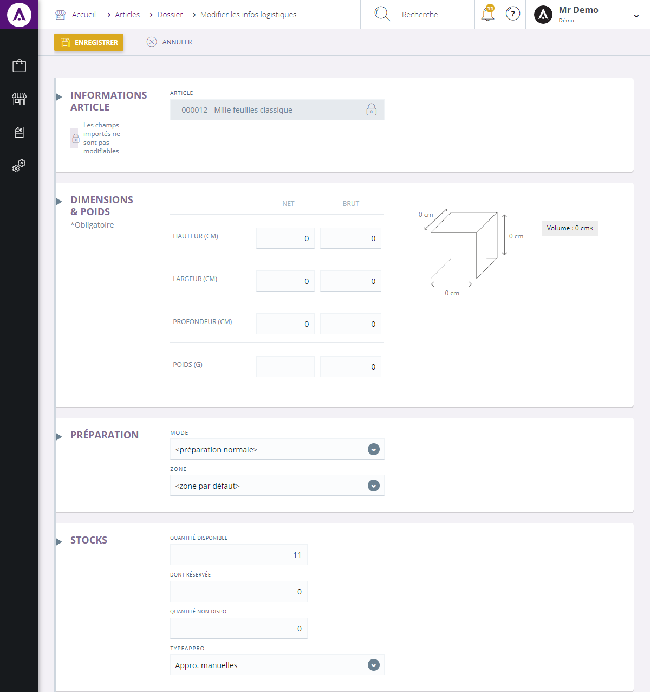
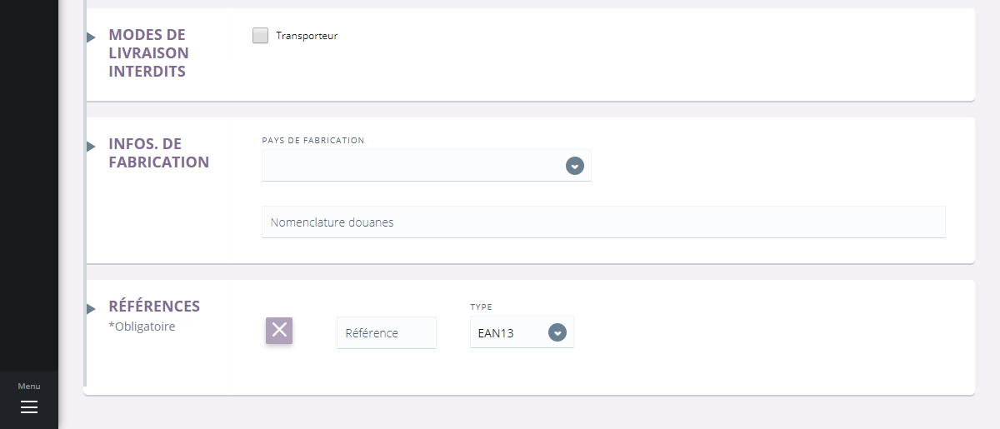

# Formulaire logistique
Ce formulaire va vous permettre de **modifier les information logistique** de votre article.

Vous pouvez **rééditer la dimensions** et **le poids** de votre article, son **mode de préparation**, son **stock disponible** ou encore **ses modes de livraisons autorisés** ou **non**.

Modification des informations logistique
----------------------------------------

Dans ce formulaire de **modification des informations logistique**, vous pourrez modifier les **dimensions** et le **poids** de votre article ainsi que son **mode de préparation** et son **stock**.

Vous verrez aussi les différents **mode de livraisons** (interdits), les **informations de fabrication** ou encore les **références** de votre article.

### Dimensions et poids

Grâce à ce formulaire, vous pouvez **modifier les dimensions** (_hauteur_, _largeur_, _profondeur_) **brut** ou **net** de votre article ainsi que son **poids**.

Ces informations vous permettront de définir le **volume total** de votre article et ainsi aider à la préparation et à l'envoi de votre produit.

### Préparation de l'article

Dans cette partie du formulaire, vous pourrez préciser le **mode de préparation** de votre article, comme :

- **Préparation normale,**

- **Sur stock,**

- **Fabrication périodique stockée.**

Ou encore sa **zone de préparation**, qui consiste à indiquer l'endroit ou les commandes sont en préparation.

### Stocks

Vous serez en mesure de modifier les **stocks** de votre article, comme :

- Le **type d'approvisionnment** du produit (manuels, avancés ...),

- La **quantité disponible** ou **non-disponible**,

- La **quantité du stock réservée** (commande en cour, réservation de produits...).

### Modes de livraisons

Afin de ne pas détériorer votre article durant la livraison, vous pouvez **interdire certains modes de livraisons**.

> A savoir : les modes de livraisons sont paramètrables

### Informations douanières

Ce critère consiste à **déclarer le pays de fabrication** du produit (fabriqué en...), vous pouvez par la même occasion y inclure la **nomenclature douanière** (type de catégorie de votre article, catégorie I, II, III, IV...).

### Références

Pour identifier l'article, vous devez inclure les différentes **références** de votre produits comme :

- Référence **EAN 13** (prix, produit...),

- Référence **fournisseur**,

- Référence **magasin**.