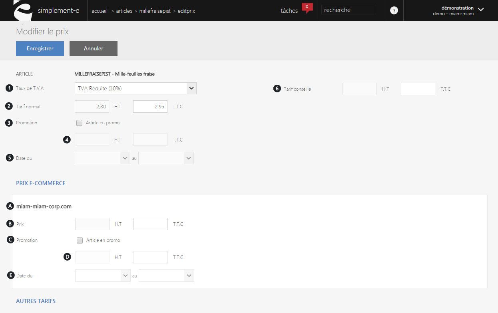

# Formulaire prix

Un <strong>formulaire de prix</strong> vous permettra:

 &nbsp;- De <strong>modifier le prix</strong> d'un article,  &nbsp;- <strong>D'ajouter une promotion</strong> ou d'en <strong>supprimer</strong> une, &nbsp;- De <strong>choisir la TVA</strong> de votre produit, &nbsp;- De modifier le <strong>tarif e-commerce</strong> de votre article.

<h3>Formulaire prix</h3>

Cette premi&egrave;re partie du formulaire vous permettra de <strong>modifier votre prix de base</strong> d'un article en y indiquant le prix HT et TTC ainsi que son taux de TVA.

Vous pouvez ajouter &agrave; cet article une <strong>promotion</strong> (prix HT et TTC) avec la <strong>date de d&eacute;but</strong> et <strong>de fin</strong> de celle-ci,&nbsp;ou encore indiquer&nbsp;le <strong>tarif conseill&eacute; par le fabricant</strong>.

Dans ce formulaire, vous trouverez :

<ol>
<li><strong>Taux de TVA</strong>: plusieurs choix possible,</li>
<li>Le <strong>tarif normal HT </strong>et<strong> TTC</strong>: c&rsquo;est-&agrave;-dire sans promotion,</li>
<li>Une case &agrave; cocher afin <strong>d'activer ou d&eacute;sactiver une promotion</strong>,</li>
<li><strong>Le prix HT</strong> et <strong>TTC de la promotion</strong>,</li>
<li>Les <strong>dates d'applications</strong>,</li>
<li>Le <strong>tarif conseill&eacute; pour le fabricant</strong>.</li>
</ol>
<h3>&nbsp;Prix e-commerce</h3>

&nbsp;La seconde partie du formulaire correspond &agrave; la <strong>modification du prix e-commerce</strong> de l'article, cela permet de modifier le prix d'un produit afin qu'il soit diff&eacute;rent du prix de base des autres sites ou magasins.

Vous pouvez, comme pour un prix normal, indiquer le prix HT et TTC que vous souhaitez mettre ou encore ajouter une promotion (prix HT et&nbsp;TTC) avec la date de d&eacute;but et de fin.

Vous pouvez trouver dans cette partie du formulaire :

<ol type="a">
<li><strong>Libell&eacute; du site</strong> ou la <strong>modification s'effectura</strong>,</li>
<li><strong>Prix HT</strong> et <strong>TTC</strong>,</li>
<li><strong>Ajout</strong> ou <strong>suppression d'une promotion</strong>,</li>
<li>Le <strong>prix de cet article en promotion</strong>,</li>
<li><strong>Date d'application</strong>.</li>
</ol>
<h3>Autres tarifs</h3>

La partie " <strong>autres tarifs</strong> " permet de remplacer les diff&eacute;rents prix applicable sur les diff&eacute;rents site <strong>e-commerce</strong>, <strong>magasins</strong>, <strong>catalogue</strong>,&nbsp;<strong>op&eacute;ration commerciale&nbsp;</strong>ou encore pour certains <strong>clients sp&eacute;cifiques</strong> (CE...).

