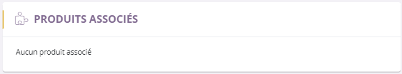

# Onglet articles associés

Cette page vous permet de visualiser les **articles associés** au votre, il existe plusieurs type associations.

### Associations manuelles

**Les associations manuelles** correspondent aux articles que vous pouvez associer avec un formulaire.

Ce formulaire vous permet **d'ajouter** ou de **supprimer** un article associé à votre produit.

Vous disposez de plusieurs types d'associations :

- **Articles parents**. (1)

- **Articles de différentes "version**", possédant deux sous-catégories :

**.**  Article de **déclinaison** (produit identique possédant plusieurs tailles, couleurs -> t-shirt).

        **.**  Article **version** (produit différent appartenant à la même famille -> mille-feuille).

- **Articles complémentaires**, possédant lui aussi plusieurs sous-catégories : (2)

**. ** Article **standard** (Upselling et cross selling). (3)

**.**  Article de **variation** (produit de même thème mais différent, en goût, couleur, taille...). (4)

> A savoir : Upselling correspond aux articles étant de gamme plus élevé. Cross selling correspond quant à lui à des ventes croisés ou des ventes additionnelles.

### Associations automatiques

Vous pouvez inclure des articles associés " **Automatiques** ", ils correspondent aux articles que **vous pouvez voir lorsque vous acheter un article** , ils apparaissent grâce :

- Aux articles **visionnés** par d'autres clients ( "les clients ont aussi regardés...").

- Aux articles **achetés** par d'autres clients ( "les clients ont aussi achetés...").

> A savoir : les données sont paramètrables.