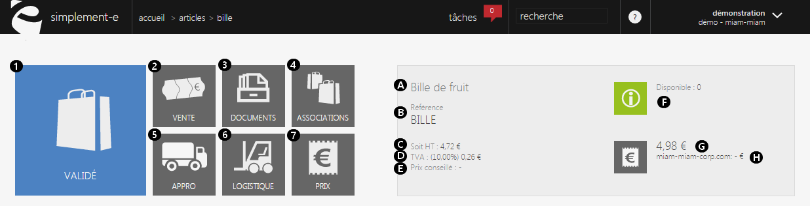
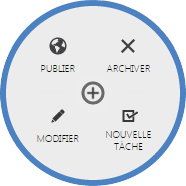
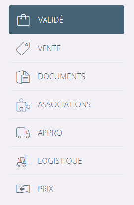
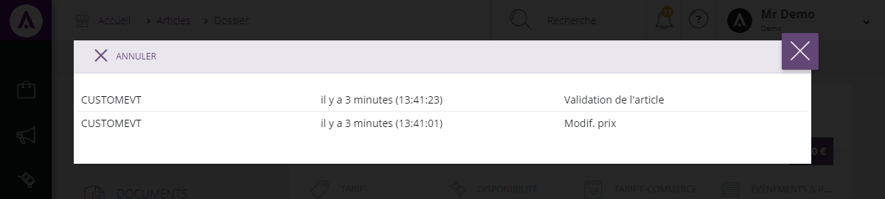

# Dossier article

Le <strong>dossier article</strong> pr&eacute;sente toute les informations de votre produit regroup&eacute;es par th&egrave;me.

&nbsp;En t&ecirc;te de page vous trouverez un r&eacute;sum&eacute; de la description de l'article.

Les blocs (visible sur votre gauche) vont vous permettre de visualiser <strong>les d&eacute;tails de votre article </strong>en cliquant sur l'un des th&egrave;mes.

Vous y trouvez :&nbsp;

<ol>
<li><a href="/fr-fr/office/gestion-commerciale/catalogue/articles/ongletprincipal.md">L'&eacute;tat</a>,</li>
<li><a href="/fr-fr/office/gestion-commerciale/catalogue/articles/ongletvente.md">Vente</a>,</li>
<li><a href="/fr-fr/office/gestion-commerciale/catalogue/articles/ongletdocument.md">Documents </a>(photos),</li>
<li><a href="/fr-fr/office/gestion-commerciale/catalogue/articles/articlesassocier.md">Articles associ&eacute;s</a>,</li>
<li><a href="/fr-fr/office/gestion-commerciale/catalogue/articles/ongletapprovisionnement.md">Pr&eacute;paration </a>(approvisionnement de l'article, stock etc...),</li>
<li><a href="/fr-fr/office/gestion-commerciale/catalogue/articles/ongletlogistique.md">Logistique </a>(dimensions de l'article, poids etc...),</li>
<li><a href="/fr-fr/office/gestion-commerciale/catalogue/articles/ongletprix.md">Prix</a>.</li>
</ol>

A c&ocirc;t&eacute; de ces onglets vous trouverez un rectangle gris clair (sur votre droite)&nbsp;qui contient <strong>les informations principales de l'article.</strong>

Vous y trouverez :&nbsp;

<ol type="a">
<li>Le libell&eacute;,</li>
<li>La r&eacute;f&eacute;rence,</li>
<li>Le prix HT du produit,</li>
<li>La TVA,</li>
<li>Le prix conseiller par le fournisseur,</li>
<li>Les informations logistique (stock disponible, approvisionnement en cour, disponibilit&eacute; chez le fournisseur),</li>
<li>Le prix TTC (en promotion si il y a une promotion),</li>
<li>Le site e-commerce ou l'article est en ligne.</li>
</ol>

<h2>Listes d'actions disponible</h2>

 Le menu d'action&nbsp;pr&egrave;s du titre, vous donnera acc&egrave;s aux actions suivantes :

<table style="width: 100%;">
<tbody>
<tr>
<td style="width: 150px;"><strong>Archiver</strong></td>
<td>Permet d'archiver l'article: celui-ci ne sera plus disponible pour la vente.</td>
</tr>
<tr>
<td style="width: 150px;"><strong>Modifier</strong></td>
<td>Permet de modifier le contenu de votre article.</td>
</tr>
<tr>
<td style="width: 150px;">&nbsp;-&nbsp; Informations g&eacute;n&eacute;rales</td>
<td>Permet de modifier les informations principales d'un article : libell&eacute;, description, informations comptables, attributs, tags &amp; labels.</td>
</tr>
<tr>
<td style="width: 150px;">&nbsp;-&nbsp; Prix</td>
<td>Permet de d&eacute;finir les tarifs de vente de votre produit.</td>
</tr>
<tr>
<td style="width: 150px;">&nbsp;-&nbsp; Logistique</td>
<td>Permet de changer la dimension et le poids, modifier les quantit&eacute;s du stock, etc...</td>
</tr>
<tr>
<td style="width: 150px;">&nbsp;-&nbsp; Articles associ&eacute;s</td>
<td>Permet d'ajouter ou de supprimer des articles compl&eacute;mentaires, des versions.</td>
</tr>
<tr>
<td style="width: 150px;">&nbsp;-&nbsp; Edition e-commerce</td>
<td>Permet de modifier les information sp&eacute;cifique&nbsp;e-commerce : le prix , les options e-commerce et cross-canal, etc...</td>
</tr>
<tr>
<td style="width: 150px;"><strong>Nouvelle t&acirc;che</strong></td>
<td>Permet de cr&eacute;er une nouvelle t&acirc;che.</td>
</tr>
<tr>
<td style="width: 150px;"><strong>Publier</strong></td>
<td>Permet de g&eacute;rer la pr&eacute;sence de votre article sur vos sites e-commerce et cross-canal.</td>
</tr>
</tbody>
</table>

&nbsp;

<h2>Ev&eacute;nements</h2>

A la suite de cette liste d'action, vous pouvez trouver un <strong>historique des &eacute;v&eacute;nements survenus</strong> sur l'article :

Cet historique pr&eacute;sente les <strong>&eacute;v&eacute;nements</strong> survenus sur l'article, les <strong>modifications</strong> importantes, <em>manuelles</em> ou <em>informatiques</em> y seront signal&eacute;es.

Chaque &eacute;v&eacute;nement correspond &agrave; une modification survenu sur l'article.

Par exemple :

<strong>1</strong> - Publication du produit sur le site e-commerce.

<strong>2</strong> - La modification du prix de l'article.

