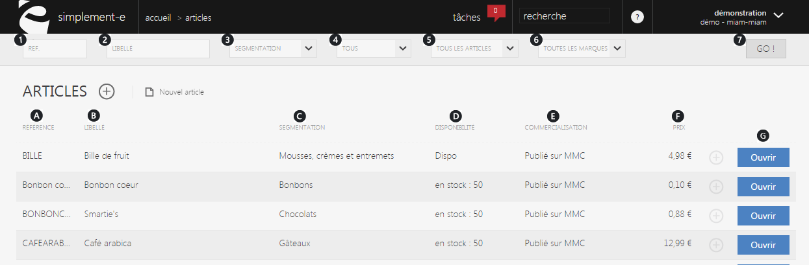
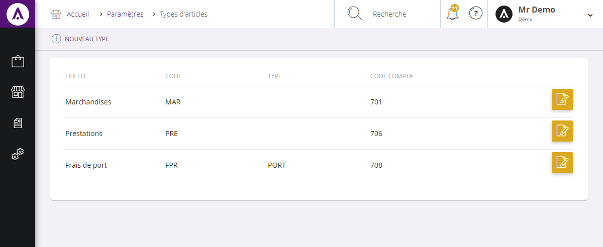

# Recherche et création d'un article 

Le catalogue produit vous permet de visualiser **l'intégralité de votre référentiel produit**; de créer, _rechercher_ et gérer vos articles.

Vous y retrouvez vos articles e-commerce, vos frais de ports, articles magasins, etc.

De cette page, vous pouvez rechercher un article rapidement grâce à la barre de _recherche_ située sur le haut de la page ou créer un nouvel article via la commande d'actions **(+)**. 

### Recherche d'un article

Vous pourrez lancer une recherche avec les critères suivants :

1.  **La référence de l'article**,
2.  **Son libellé,**
3.  **Sa famille** (ou sa segmentation si vous êtes en mode e-commerce),
4.  **Son état** (en cours élaboration, commercialisé ou archivé),
5.  **S****es canaux de commercialisation** (par exemple, le site web sur lequel il est publié),
6.  **Sa marque.**

Pour lancer la recherche, cliquez sur **" GO ! "** (7).

Ces critères vous permettront de rechercher un article rapidement en saisissant les informations dont vous disposez.

> A savoir : tout les critères ne sont pas obligatoires pour une recherche

###  Articles

Cette page vous donne accès à **l'intégralité** **de** **vos** **articles,** elle vous permet de les gérer ou encore d'accèder à plus d'informations.

Les produits sont triés selon leur référence, chaque ligne représente un article issu de votre catalogue et vous donne accès à certaines informations :

1.  **La référence du produit** (numéro d'identification),
2.  **Son libellé,**
3.  **Sa segmentation** (classification du produit),
4.  **Son stock disponible,**
5.  **La commercialisation du produit** (site e-commerce, magasin etc),
6.  **Son prix.**

Pour accéder aux informations d'un dossier article, cliquez sur le lien bleu " **Ouvrir** " (G).

### Actions

La **commande d'action** que vous pouvez apercevoir près du titre, correspond au menu de commande.  
Il vous permet d'accéder à différentes actions qui vous permettront de gérer vos articles.

_Exemple_ de commande dont vous pouvez disposer :

** Nouvel article**

 Cette action va donc vous permettre d'accéder au formulaire vous permettant de créer un nouvel article.

Créer un article
----------------

Pour créer un article, cliquez sur la **commande d'action** puis sur " **Nouvel article "** près du titre.

Choisissez le type d'article :   
       - **Article e-commerce**  
**       - Service**  
       - Etc …  
   
Vous serez redirigé vers un **formulaire** vous permettant de débuter la création du nouveau produit.

> A savoir : Les types d'articles sont paramètrables