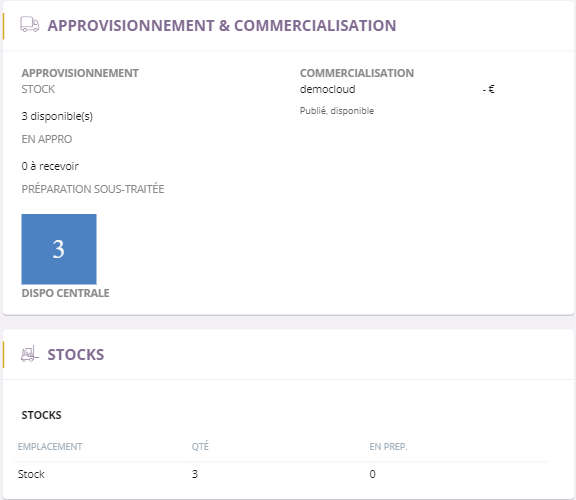

# Onglet approvisionnement

Cette page va vous permettre de visualiser les **informations d'approvisionnements** et de **stockages** de votre produit.

### L'approvisionnement général

**L'approvisionnement** comprend quatre critères importants que vous retrouverez partout,

1.  Le **stock disponible**, qui correspond au stock de votre produit.
2.  Le **stock en approvisionnement**, qui correspond aux réapprovisionnements de votre stock pour cet article.
3.  Le **stock sous-traité**, qui correspond aux commandes faites directement auprès du fournisseur.
4.  Le **stock disponible en centrale** correspond à votre stock produit plus les stocks des différentes versions.
5.  Le **stock principal** correspond au stock majoritaire de votre produit.
6.  Le **stock en préparation**, qui correspond aux commandes clienst en cour d'élaboration.

> A savoir : Vous ne pouvez vendre plus que ce que vous possédez dans vos stock.

### L'approvisionnement direct

Dans certains cas, lorsqu'un article ne posséde **aucun stock**, il sera en **approvisionnement direct**.

Ce processus vous permet de **commander directement** vos produits auprès de votre **fournisseur** lorsque vous avez une commande.

Ce type d'approvisionnement se fait, _par exemple_, avec des produits frais ou périssables afin de ne pas avoir de perte.

### Stocks des différentes versions

Certains articles possèdent **plusieurs références**, elles correspondent à des produits de **différentes versions ou déclinaisons** (tailles, couleurs...).

L'article et les versions apparaissent dans le stock de la centrale mais **chaque référence possède son stock principal séparé de votre article**.