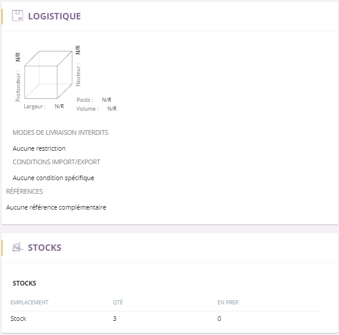

# Onglet logistique

Cet onglet va vous permettre de **visualiser les informations logistiques** de votre article telles que:

 - ses **dimensions**,  
 - ses **conditions de stockages**,  
 - ses **références** (code ean13 etc)  
 - son **mode de livraison.**

### Dimensions et références du produit

Cette page va vous permettre de visualiser certaines informations de votre article comme notamment :

**1.**      - Les **dimensions** d'un article (hauteur, largeur et profondeur),

 - Son **poids**,

 - Son **volume**.

> A savoir : ces informations correspondent à des données **brut**.

Pour identifier votre article, vous avez accès aux différentes références qui vous permettront de visualiser d'autres informations sur votre produit.

Vous pouvez pouvez avoir :

- La référence **EAN 13**,

- La référence **fabricant**,

- La référence **magasin**,

- Etc...

### Stocks

Cet onglet vous donne accès à vos stocks, qui vous indiquera :

**2.**     - Votre **stock principal**, qui correspond au stock principal de votre article.

  
        - La **quantité d'article en préparation** pour une ou plusieurs commandes.

        - Etc...

> A savoir : Vous pouvez avoir plusieurs stocks pour un article, ceci correspond par exemple aux différentes tailles ou couleurs.

### Modes de livraisons et conditions d'import/export

Vous pouvez avoir accès aux différents mode de livraisons autorisés ou non ainsi qu'aux conditons d'import/export de votre article.

**3. **    - Selon le type de produit à livrer, **certains modes de livraisons peuvent être interdit** afin de ne pas détériorer le produit.

        - Vous aurez accès aux détails du **conditionnement de l'import/export** de l'article ainsi que de sa **catégorisation douanière**.

### Information de sécurité

**4.**    Vous pouvez accéder aux **informations de sécurité** de l'article car certains produits peuvent être fabriqués à partir de matériaux dangereux.

La partie logistique vous informe via les **sigles des matières dangereuses**, de la **composition** et de la **dangerosité** de votre article.