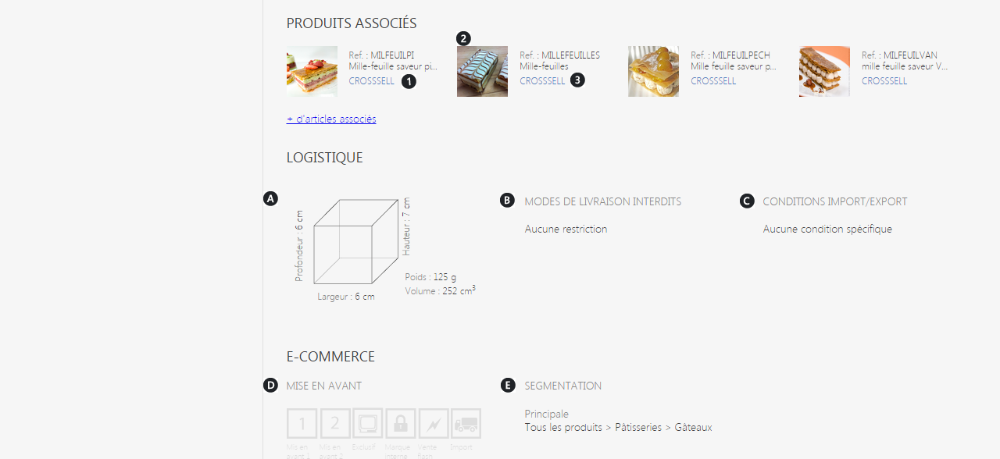

# Onglet principal

<strong>L'onglet principal</strong> s'affichera lorsque vous ouvrirez le dossier de l'article.

Il s'occupe de g&eacute;rer les <strong>informations g&eacute;n&eacute;rales</strong> d'un produit en pr&eacute;sentant ses <strong>caract&eacute;ristiques.</strong>

<h3>Informations g&eacute;n&eacute;rales</h3>

Les <strong>informations g&eacute;n&eacute;rales</strong> correspondent aux donn&eacute;es principales de votre article, elles doivent vous permettre d'identifier votre produit.

Vous pouvez visualiser les informations descriptives de l'article :

<ol>
<li>Le <strong>libell&eacute;</strong> de l'article,</li>
<li>Sa&nbsp;<strong>r&eacute;f&eacute;rence</strong> et sa <strong>date de cr&eacute;ation</strong>,</li>
<li>Ses&nbsp;<strong>images principales</strong> et <strong>secondaires</strong>,</li>
<li>Sa <strong>marque</strong>,</li>
<li>Son <strong>imputation comptable</strong> (article e-commerce, article de magasin...),</li>
<li>Sa <strong>famille</strong>, <strong>sous-famille</strong> du produit,</li>
<li>Son&nbsp;<strong>descriptif</strong>.</li>
</ol>

Vous pouvez trouver <strong>plusieurs attributs</strong> qui vont <strong>personnaliser</strong> votre produit et informer la client&egrave;le avec des <strong>donn&eacute;es compl&eacute;mentaires</strong>. (8)

<h3>&nbsp;Approvisionnement et commercialisation</h3>

Cette partie va vous permettre de visualiser les <strong>informations primaires d'approvisionnement</strong> et de <strong>commercialisation</strong>.

<blockquote>

A savoir : cet onglet est un r&eacute;sum&eacute; de l'onglet approvisionnement concernant la partie gestion de vos stocks.

</blockquote>

<strong>L'approvisionnement&nbsp;</strong>comprend quatres crit&egrave;res important que vous retrouverez partout,

<ol type="a">
<li>Le&nbsp;<strong>stock disponible</strong>, qui correspond au stock total.&nbsp;</li>
<li>Le&nbsp;<strong>stock sous-trait&eacute;</strong>, qui correspond au commande faites directement aupr&egrave;s du fournisseur.</li>
<li>Le&nbsp;<strong>stock disponible</strong> en centrale.</li>
<li>La <strong>partie commercialisation</strong>, qui correspond au site e-commerce, magasin... o&ugrave; l'article est disponible.</li>
</ol>

Pour acc&eacute;der &agrave; plus d'information, cliquez sur : <a href="/fr-fr/office/gestion-commerciale/catalogue/articles/ongletapprovisionnement.md">Onglet approvisionnement</a>

<h3>Produits associ&eacute;s</h3>

Cette partie correspond aux <strong>articles qui peuvent &ecirc;tre associ&eacute;s</strong> &agrave; votre produit via une association <strong>manuelle</strong> ou <strong>automatique</strong>.

Vous pouvez visualiser les informations suivantes :

<ol>
<li><strong>Articles associ&eacute;s " Parents</strong> <strong>",</strong> article mod&egrave;le.</li>
<li><strong>Articles associ&eacute;s " Compl&eacute;mentaires ".</strong></li>
<li><strong>Articles associ&eacute;s compl&eacute;mentaires " Standard ",</strong> <em>upselling</em> ou <em>cross selling</em>.</li>
</ol>

&nbsp;Pour voir l'int&eacute;gralit&eacute; des articles, cliquez sur : <a href="/fr-fr/office/gestion-commerciale/catalogue/articles/articlesassocier.md">Onglet article associ&eacute;s</a>

<h3>&nbsp;Logistique</h3>

&nbsp;Cette partie va vous permettre de visualiser les <strong>informations logistiques</strong> de votre article.

Vous pourrez visualiser les informations suivantes :

<ol type="a">
<li>Les <strong>dimensions</strong> du produit (hauteur, largeur, profondeur) ainsi que son <strong>poids</strong> et <strong>volume</strong>.</li>
<li>Son <strong>mode de livraison autoris&eacute;s </strong>ou<strong> non</strong>.</li>
<li>Les <strong>conditions d'import/export</strong> et sa <strong>cat&eacute;gorisation douani&egrave;re</strong>.</li>
</ol>

Vous pouvez acc&egrave;der &agrave; plus d'informations : <a href="/fr-fr/office/gestion-commerciale/catalogue/articles/ongletlogistique.md">Onglet logistique</a>

<h3>E-commerce</h3>

Les crit&egrave;res e-commerce correspondent aux informations sur la <strong>mise en avant</strong> de votre article ainsi que sur sa <strong>segmentation</strong>.

Vous retrouvez dans cette partie :

&nbsp;&nbsp;&nbsp;&nbsp;&nbsp; d.&nbsp; La <strong>mise en avant</strong> de l'article, qui correspond aux tags (promotion) et aux labels (fabriqu&eacute; en...).

&nbsp;&nbsp;&nbsp;&nbsp;&nbsp;&nbsp;e.&nbsp; La <strong>segmentation principale</strong>, mots cl&eacute;s de recherche.

Afin de visualiser plus d'informations, cliquez sur : <a href="/fr-fr/office/gestion-commerciale/catalogue/articles/ongletvente.md">Onglet vente</a>

&nbsp;

&nbsp;

