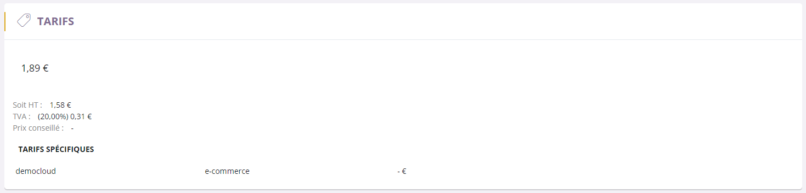

# Onglet prix

Cette page va vous permettre de visualiser les diff&eacute;rents <strong>prix de votre article</strong>, ses taxes ainsi que ses tarifs sp&eacute;cifiques.

Il existe plusieurs types de tarifs :

<ul>
<li>Tarifs de base</li>
<li>Tarifs sp&eacute;cifiques &agrave; un canal de vente</li>
<li>Grille de tarif</li>
<li>Etc...</li>
</ul>
<h3>Tarifs de base</h3>

La partie tarif d'un article vous permet de conna&icirc;tre les d&eacute;tails du prix TTC de l'article.

Vous pouvez voir :

- Le <strong>prix TTC</strong>,

- Une <strong>promotion</strong> avec sa date,

- Le <strong>prix HT</strong>,

- Le <strong>pourcentage de la TVA</strong>,

- Le <strong>prix conseill&eacute; par le fabricant</strong>.

<h3>Tarifs sp&eacute;cifiques</h3>

Un tarif sp&eacute;cifique est un <strong>prix d&eacute;fini sp&eacute;cialement pour un canal de vente donn&eacute;</strong>.

<h3>Grille de tarif</h3>

La grille de tarif correspond &agrave; la <strong>liste de toute les conditions tarifaires sp&eacute;cifique applicable au poduit</strong>.

C'est un tarif sp&eacute;cial fait pour un &eacute;v&eacute;nement ou un groupe particulier.

<em>Par exemple</em>, vous pouvez faire un prix pour un &eacute;v&eacute;nement (publicit&eacute;...) ou encore pour un groupe de personne (CE...).

