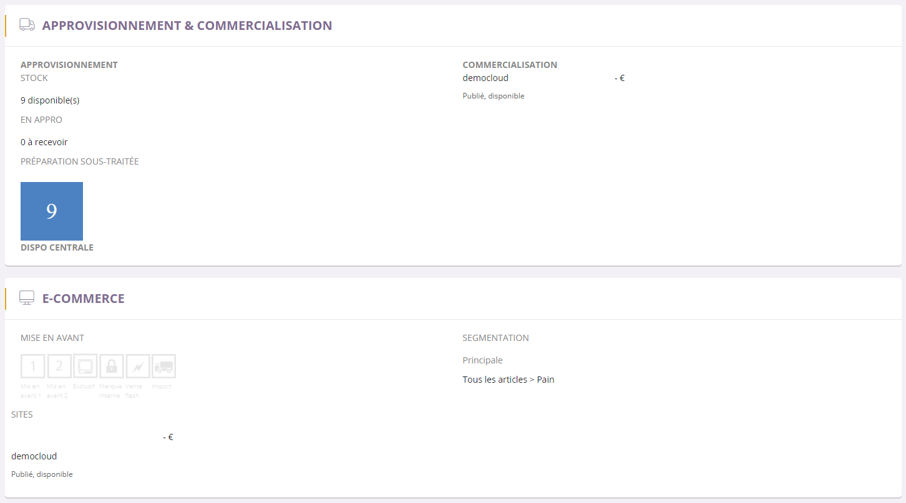

# Onglet vente

Cette page va vous permettre de visualiser la <strong>commercialisation</strong> de votre article gr&acirc;ce notamment,

-&nbsp;&nbsp;aux informations de <strong>stock</strong>,&nbsp;

-&nbsp; de <strong>commercialisation</strong>

-&nbsp; aux informations <strong>e-commerce</strong>.

<h3>&nbsp;Approvisionnement</h3>

<strong>L'approvisionnement</strong> comprend quatres crit&egrave;res important que vous retrouverez partout,

<ol type="a">
<li>Le <strong>stock disponible</strong>, qui correspond au stock&nbsp;disponible pour la vente.&nbsp;</li>
<li>Le <strong>stock en approvisionnement</strong>, qui correspond au r&eacute;approvisionnement de votre stock pour cet article.</li>
<li>Le <strong>stock sous-trait&eacute;</strong>, qui correspond au commande faites directement aupr&egrave;s du fournisseur.</li>
<li>Le <strong>stock disponible en centrale</strong> correspond &agrave; votre stock produit plus les stocks des diff&eacute;rentes versions.</li>
</ol>
<blockquote>

A savoir : cette partie est un r&eacute;sum&eacute; de votre onglet approvisionnement concernant la partie gestion de vos stocks.

</blockquote>
<h3>E-commerce</h3>

Les crit&egrave;res e-commerce correspondent aux informations sur la <strong>mise en avant</strong> de votre article ainsi que sur sa <strong>segmentation</strong>.

Vous pouvez y voir les diff&eacute;rents <strong>tags</strong> et <strong>labels</strong> qui mettent votre article en avant via plusieurs crit&egrave;res (vente flash, exclusivit&eacute;...) ou encore la <strong>segmentation principale</strong> de votre produit, qui caract&eacute;rise les diff&eacute;rents crit&egrave;res de recherche de votre article.

Vous pouvez retrouver dans cette page :

<ol>
<li>La <strong>mise en avant</strong> de l'article, qui correspond aux tags (promotion...) et aux labels (Fabriqu&eacute; en...).</li>
<li>La <strong>segmentation principale.</strong></li>
<li>Le <strong>site e-commerce</strong> ou <strong>cross canal</strong> sur lequel il est publi&eacute; et disponible.</li>
</ol>
<blockquote>

A savoir : les tags et labels ont le r&ocirc;le de mettre en avant votre produit et de fournir des informations suppl&eacute;mentaires :

-&nbsp;Un <strong>tag&nbsp;</strong>correspond &agrave; la mise en avant d'un article (promotion, vente flash, vente exclusif etc...).

-&nbsp;Un <strong>label&nbsp;</strong>correspond &agrave; une information suppl&eacute;mentaire (fabriqu&eacute; en .. etc).

</blockquote>

&nbsp;

