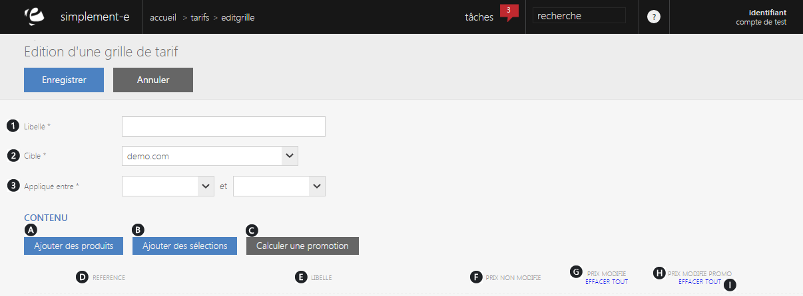

# Nouvelle grille de tarif

<h3>Cr&eacute;ation d'une grille de tarifs</h3>

Pour cr&eacute;er une grille de tarifs, cliquez sur la&nbsp;commande d'action&nbsp;puis sur "<strong>Nouvelle grille</strong>" pr&egrave;s du titre.

Vous serez redirig&eacute; vers un <strong>formulaire</strong> d'&eacute;dition vous permettant de <strong>cr&eacute;er une nouvelle grille tarifaire</strong>, vous devrez remplir les diff&eacute;rentes <strong>informations de bases</strong> de la grille :

<ol>
<li>Le <strong>titre</strong> que vous souhaitez donner &agrave; cette grille</li>
<li>La <strong>cible</strong> de cette&nbsp;grille (site e-commerce)</li>
<li>La <strong>date d'application</strong> (date de cr&eacute;ation)</li>
</ol>

Pour cr&eacute;er une nouvelle grille, vous devrez <strong>ajouter des produits</strong> ou <strong>s&eacute;lections</strong> et <strong>calculer les promotions</strong> qui se feront sur les articles de cette grille.

Vous trouverez dans ce contenu :

<ol>
<li>Le lien <strong>d'ajout d'un produit</strong></li>
<li>Celui <strong>d'ajout d'une s&eacute;lection</strong></li>
<li>Le <strong>calcul d'une promotion</strong></li>
<li>La <strong>r&eacute;f&eacute;rence</strong> du produit</li>
<li>Son <strong>libell&eacute;</strong></li>
<li>Son <strong>prix de base</strong> (non modifi&eacute;)</li>
<li>Son <strong>prix modifi&eacute;</strong></li>
<li>Son <strong>prix modifi&eacute; apr&egrave;s le calcul de promotion</strong></li>
<li>Lien qui vous permettra de <strong>supprimer</strong> un prix.</li>
</ol>

Pour cr&eacute;er votre grille, cliquez sur <strong>Enregistrer</strong> en haut &agrave; gauche.

<h3>MODIFICATION D'UNE GRILLE DE TARIFS</h3>

Pour <strong>modifier une grille de tarifs</strong>, il vous suffit de cliquer sur le bouton bleu <strong>Ouvrir</strong> &agrave; droite d'une grille.

Vous serez redirig&eacute; vers un <strong>formulaire</strong> similaire &agrave; celui de cr&eacute;ation, tout les articles de cette grille apparaitront.

Vous pourrez <strong>modifier le prix</strong> (promotion...) de chaque article, <strong>ajouter</strong> ou <strong>supprimer des articles, des s&eacute;lections</strong> ou encore<strong> modifier les informations de bases</strong> (libell&eacute;, date d'application...).

