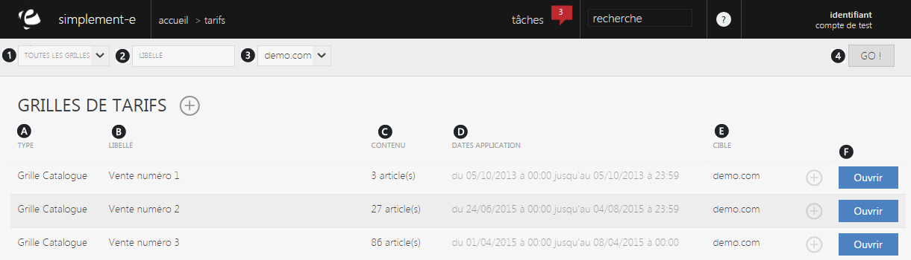

# Grille de tarifs

La <strong>grille</strong> <strong>de tarif</strong> correspond &agrave; la liste de toute les <strong>conditions tarifaires sp&eacute;cifique applicable au poduit</strong>.

C'est un tarif sp&eacute;cial fait pour un &eacute;v&eacute;nement ou un groupe particulier.

<em>Par exemple</em>, vous pouvez faire un prix pour un &eacute;v&eacute;nement (publicit&eacute;...) ou encore pour un groupe de personne (CE...).

<h3>Recherche d'une grille de tarifs</h3>

Vous pourrez lancer une recherche avec les crit&egrave;res suivant :

<ol>
<li><strong>Liste de toute les grilles&nbsp;de tarifs</strong></li>
<li><strong>Libell&eacute;</strong> de cette grille</li>
<li><strong>Site e-commerce</strong> ou l'on peut le trouver</li>
</ol>

Pour<strong> lancer la recherche</strong>, cliquez sur le bouton <strong>GO</strong> (4)

<blockquote>

A savoir : tout les crit&egrave;res ne sont pas obligatoire

</blockquote>
<h3>Grille de tarifs</h3>

Cette page vous donne <strong>acc&egrave;s &agrave; l'int&eacute;gralit&eacute; de vos grilles de tarifs</strong> et vous permet de les <strong>g&eacute;rer</strong>.

Les grilles sont tri&eacute;es selon leur type ou selon leur libell&eacute;, chaque ligne correspond &agrave; une grille de tarifs.

<ol type="a">
<li>Le <strong>type &nbsp;&nbsp; &nbsp;&nbsp;</strong></li>
<li>Le <strong>libell&eacute;&nbsp; &nbsp; &nbsp;</strong></li>
<li>Le <strong>nombre d'articles</strong> dans cette grille&nbsp;&nbsp;&nbsp;&nbsp;&nbsp;</li>
<li>Sa <strong>date d'application</strong> (date de cr&eacute;ation)&nbsp;&nbsp;&nbsp;&nbsp;&nbsp;</li>
<li>Le <strong>site e-commerce</strong> ou&nbsp;l'on peut la trouver&nbsp;&nbsp;&nbsp;&nbsp;&nbsp;&nbsp;&nbsp;</li>
</ol>

Pour acc&eacute;der aux informations de la grille, cliquez sur le bouton bleu <strong>Ouvrir (F).</strong>

<h3>Actions</h3>

La<strong>&nbsp;commande d'action</strong>&nbsp;que vous pouvez apercevoir pr&egrave;s du titre correspond au menu de commande.

Il vous permet d'acc&eacute;der &agrave; diff&eacute;rentes actions qui vous permettront de g&eacute;rer vos grilles.

<em>Exemple</em> de commande dont vous pouvez disposer :

<table>
<tbody>
<tr>
<td><a href="/fr-fr/office/gestion-commerciale/catalogue/grilledetarifs/EditGrille.html">Nouvelle grille</a></td>
<td>Cette action permet de cr&eacute;er une nouvelle grille de tarifs</td>
</tr>
</tbody>
</table>

