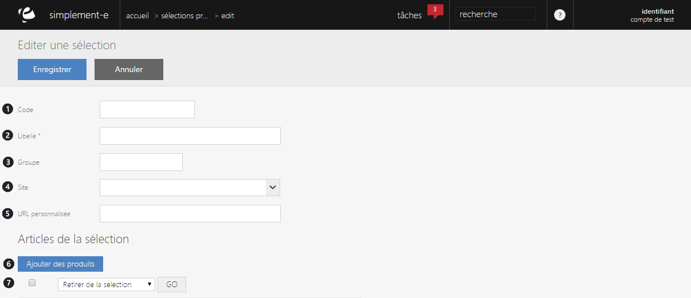
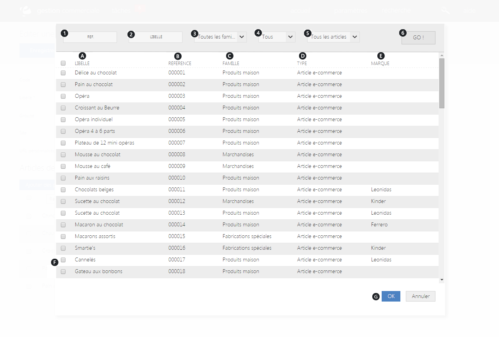

# Sélection automatique 

### Sélection manuelle

En choisissant une **sélection manuelle**, vous serez redirigé vers un **formulaire** permettant la création d'une nouvelle action commerciale.

Afin de **créer** une opération commerciale via une sélection manuelle, vous devez rentrer un par un les articles que vous souhaitez mettre dans celle-ci.

Pour cela, vous devez cliquer sur le lien " **Ajouter des produits** ".

Vous trouverez dans ce formulaire :

1.  Le **code** de la sélection,
2.  Son **titre**,
3.  Son **groupe d'appartenance** (publicité, solde...),
4.  Le **site e-commerce** sur lequel l'opération est publiée,
5.  **URL personnalisé**,
6.  **Ajout d'un article**,
7.  **Barre déroulante** permettant des **actions** (suppression d'un article) ou des **modifications** (mise en avant...).

### Ajout d'un article

Pour ajouter un article à une sélection, cliquez sur le bouton : "**Ajouter des produits**".

**L'ajout d'un article** vous permet d'insérer un nouveau produit dans une **sélection déjà existante** ou en **cour de création**. (1)

Vous pouvez aussi **retirer de la sélection** un article que vous ne souhaitez plus voir dans celle-ci, ou encore **modifier la pertinence de l'article** (mise en avant...). (2)

> A savoir : Cette méthode s'applique uniquement pour une sélection manuelle ou déjà créée.

Pour **ajouter un produit à une sélection**, vous disposez de plusieurs critères qui vous permettront d'insérer un article à une sélection.

Pour trouver un produit que vous souhaitez mettre dans la sélection, vous devez mettre dans la sélection, vous devez rentrer les critères suivant dans la barre de recherche :

1.  La **référence de l'article**,
2.  Son **libellé**,
3.  Sa **famille**,
4.  Son **état** (en cour d'élaboration, validé...),
5.  Ses **canaux de commercialisation** (sites e-commerces, magasins...).

Afin de lancer la recherche, cliquez sur le bouton : **GO** (6)

> A savoir : tout les critères ne sont pas obligatoires pour lancer une recherche.

Les produits sont triés selon leur référence, chaque ligne représente un article issu de votre catalogue et vous donne accès à certaines informations :

1.  Le **libellé de l'article**,
2.  Sa **référence**,
3.  Sa **famille**,
4.  Son **canal** **de commercialisation** (site e-commerce, magasin...),
5.  Sa **marque** (Ferrero, Haribo...).

Pour ajouter un produit à votre sélection, **cochez la case** à gauche de l'article (F) puis cliquez sur **OK** sur le bas de la page (G) pour **valider l'ajout**.

> A savoir : vous pouvez cochez plusieurs cases lorsque vous souhaitez ajouter plusieurs articles dans une sélection.
> 
> A savoir : dans la barre de recherche, vous pouvez mettre autant de référence que vous le souhaitez tant qu'elles sont séparées par un espacement.