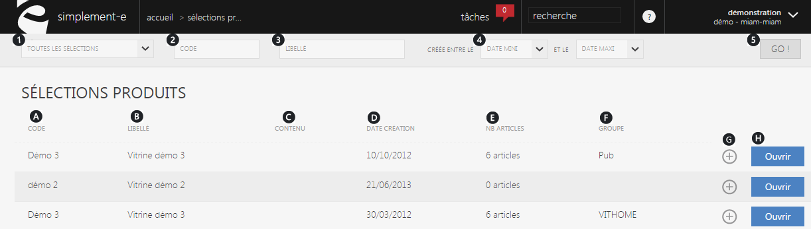
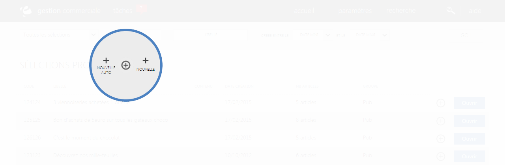

# Recherche et création d'une sélection

Le <strong>catalogue</strong> vous permet de visualiser <strong>l'int&eacute;gralit&eacute; de vos s&eacute;lections d'articles</strong>; de <strong>cr&eacute;er</strong>, <strong>rechercher</strong> et <strong>g&eacute;rer vos s&eacute;lections.</strong>

Vous y retrouverez vos <strong>s&eacute;lections</strong> d&eacute;j&agrave; cr&eacute;&eacute;es ainsi que le reste de celles-ci.

De cette page, vous pouvez <strong>rechercher une s&eacute;lection</strong> rapidement gr&acirc;ce &agrave; la <em>barre de recherche</em> situ&eacute; sur le haut de la page.

Vous pouvez aussi <strong>cr&eacute;er</strong> une nouvelle s&eacute;lection via la commande d'action <strong>(+)</strong>.

<em>Cf : <a href="/start/default.aspx">premiers pas s&eacute;lections</a></em>

<h3>Recherche d'une s&eacute;lection</h3>

Vous pouvez lancer une recherche avec les crit&egrave;res suivants :

<ol>
<li><strong>Types de s&eacute;lections</strong></li>
<li>Son<strong> code&nbsp;</strong>(r&eacute;f&eacute;rence)</li>
<li>Son<strong> libell&eacute; </strong></li>
<li>Sa<strong> date de cr&eacute;ation </strong></li>
</ol>

Pour lancer la recherche, cliquez sur le bouton de lancement " <strong>GO!</strong> ". (5)

Ces crit&egrave;res vous permettront de rechercher une s&eacute;lection rapidement en rentrant les informations dont vous disposez.

<blockquote>

A savoir : tout les crit&egrave;res ne sont pas obligatoires pour une recherche

</blockquote>
<h3>S&eacute;lections</h3>

Cette partie vous donne acc&egrave;s &agrave; l'int&eacute;gralit&eacute; de vos s&eacute;lections, elle vous permet de les modifier ou encore d'acc&egrave;der &agrave; l'ensemble de leurs informations.

Ces s&eacute;lections sont tri&eacute;es selon leur code, leur libell&eacute;, leur contenu et d'autres crit&egrave;res :

<ol type="a">
<li><strong>Code </strong></li>
<li><strong>Libell&eacute; </strong></li>
<li><strong>Contenu de la s&eacute;lection </strong></li>
<li><strong>Date de cr&eacute;ation</strong></li>
<li><strong>Nombres d'articles dans cette s&eacute;lection</strong></li>
<li><strong>Groupe</strong> (publicit&eacute;, promotion, solde...)</li>
<li><strong>Bouton d'action</strong> (retour ou archivage)</li>
</ol>

Pour acc&egrave;der aux informations d'une s&eacute;lection, cliquez sur le lien bleu<strong> "Ouvrir"</strong>. (H)

<h3>Actions</h3>

La&nbsp;<strong>commande d'action</strong>&nbsp;que vous pouvez apercevoir pr&egrave;s du titre, correspond au menu de commande.

Ce menu vous permet d'acc&eacute;der &agrave; diff&eacute;rentes commande qui vous permettront de g&eacute;rer vos articles.

<em>Exemple</em> de commande que vous pouvez avoir :

<table>
<tbody>
<tr>
<td><a href="/fr-fr/office/gestion-commerciale/catalogue/selections/Edit.aspx">Nouvelle auto</a></td>
<td>&nbsp;Cette action va vous permettre de cr&eacute;er une nouvelle s&eacute;lection automatiquement.</td>
</tr>
<tr>
<td><a href="/fr-fr/office/gestion-commerciale/catalogue/selections/selectionmanuelle.aspx">Nouvelle</a></td>
<td>&nbsp;Ce lien va vous permettre de cr&eacute;er une nouvelle s&eacute;lection manuellement.</td>
</tr>
</tbody>
</table>
<h2>&nbsp;Cr&eacute;er une s&eacute;lection</h2>

Pour cr&eacute;er une nouvelle s&eacute;lection, cliquez sur la&nbsp;<strong>commande d'action</strong>&nbsp;pr&egrave;s du titre.

Lorsque vous cliquerez sur la&nbsp;<strong>commande d'action</strong>, vous aurez le choix entre plusieurs types de s&eacute;lections :

<table>
<tbody>
<tr>
<td><a title="S&eacute;lection automatique" href="/fr-fr/office/gestion-commerciale/catalogue/selections/Edit.aspx">&nbsp;<strong>S&eacute;lection automatique</strong></a></td>
<td>&nbsp;Permet de saisir plusieurs articles gr&acirc;ce &agrave; certaines conditions.</td>
</tr>
<tr>
<td><a title="S&eacute;lection manuelle" href="/fr-fr/office/gestion-commerciale/catalogue/selections/selectionmanuelle.aspx"><strong>&nbsp;S&eacute;lection manuelle</strong></a></td>
<td>&nbsp;Permet de cr&eacute;er une s&eacute;lection en saissant un par un les articles que vous souhaitez y mettre.</td>
</tr>
<tr>
<td>&nbsp;Etc...</td>
<td>&nbsp;</td>
</tr>
</tbody>
</table>

Apr&egrave;s avoir choisis une s&eacute;lection, vous serez redirig&eacute; vers un <strong>formulaire</strong> vous permettant de d&eacute;buter la cr&eacute;ation de votre nouvelle s&eacute;lection.

<blockquote>

A savoir : l'option de cr&eacute;ation d'une s&eacute;lection est soumis &agrave; une autorisation, si vous ne voyez pas cette option dans vos param&egrave;tres, contactez votre administrateur.

</blockquote>
<blockquote>

A savoir : les types de s&eacute;lections sont param&egrave;trables.

</blockquote>

