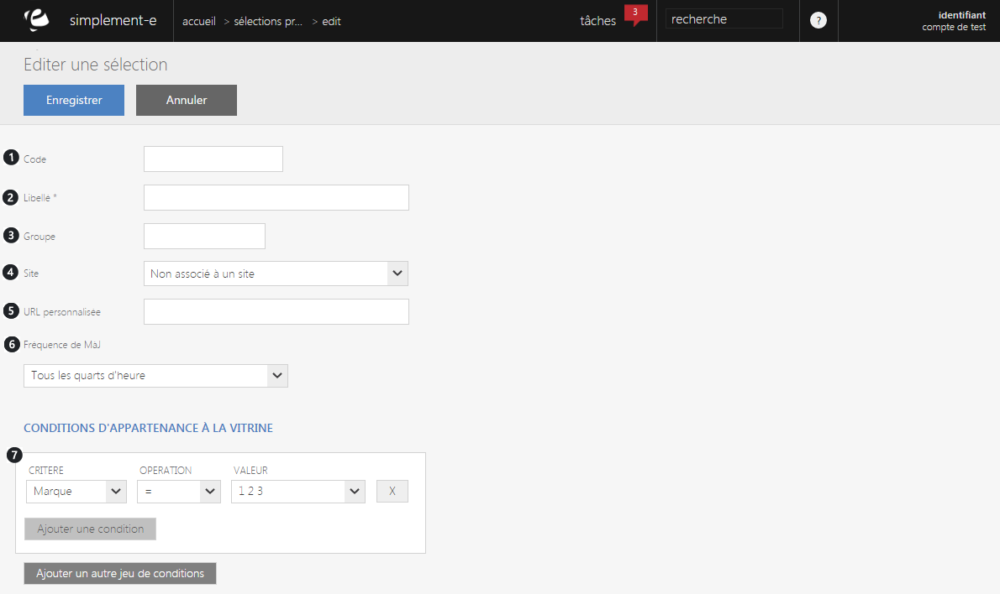
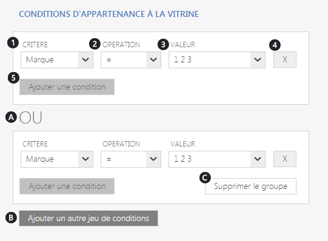

# Sélection manuelle

### Sélection automatique

Si vous choisissez de **créer une sélection automatique**, vous serez redirigé vers un **formulaire** vous permettant de débuter la création de la nouvelle sélection.

Une **sélection automatique** créée une action commerciale grâce aux **critères d'appartenances** (marque, référence...), ceci permet d'introduire tout les articles d'une même famille (référence, marque...) dans une nouvelle sélection.

_Par exemple_, en rentrant la marque Ferrero dans les conditions d'appartenance à l'opération, tout les produits Ferrero seront inclus dans une sélection.

Vous pouvez trouver les critères suivant dans un formulaire :

1.  **Code** de la sélection (référence),
2.  Le **titre**,
3.  Le **groupe d'appartenance** (publicité, solde..),
4.  Le **site e-commerce** ou la vitrine se trouve,
5.  **L'URL personnalisé** (optimisation de la recherche via les moteurs de recherche),
6.  **La fréquence de mise à jour de la vitrine.**
7.  **Conditions d'appartenance** à la vitrine.

### Ajout d'un autre jeu de conditions

 Vous pouvez aussi ajouter un autre jeu de condition ou une condition.

Le fait **d'ajouter une condition va vous permettre de rajouter une ligne de critères** qui vous permettront de **rajouter un produit supplémentaire** dans votre sélection.

Vous pouvez voir par exemple :

1.  Les **critères d'appartenances** (références, disponibilité, marque...),
2.  **L'opération** (en stock, égal...),
3.  La **valeur du produit**,
4.  Un **bouton de suppression** de la condition,
5.  Un **bouton d'ajout** d'une condition.

> A savoir : vous pouvez ajouter autant de ligne de condition que vous le souhaitez

Les conditions vont vous permettre de **choisir les produits que vous souhaitez mettre dans votre sélection **de façon à ce que tout les articles, _par exemple_, d'une **même marque soit mis dans celle-ci**.

Un des critères les plus important correspond à **ajouter un autre jeu de conditions** (B), ça va vous permettre de **créer un nouveau bloc de critères d'appartenance**. (A)

_Par exemple_, ceci vous permettra de varier votre sélection avec des produits similaires mais de différentes marques.

 Cet ajout vous permettra de créer de nouvelles conditions à la vitrine.

Vous pouvez aussi supprimer un bloc de condition, pour cela cliquez sur " **Supprimer le groupe** ". (C)