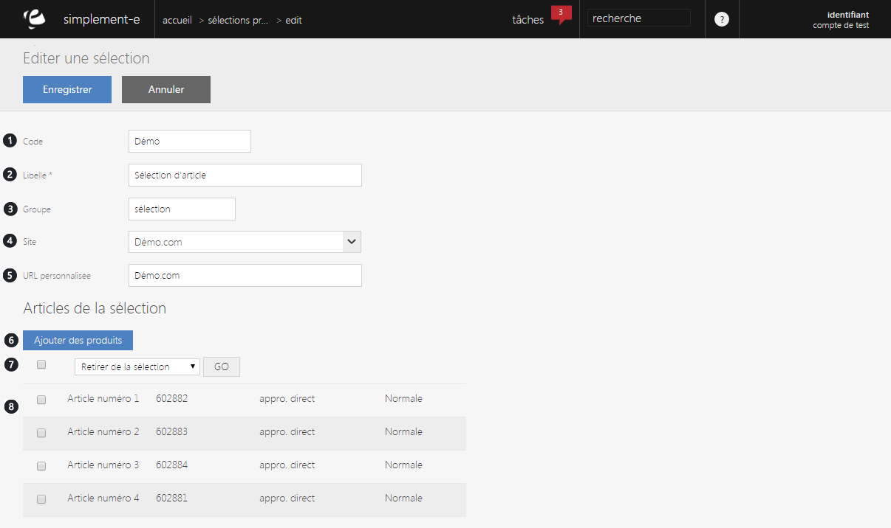

# Vos sélections

En&nbsp;ouvrant une s&eacute;lection,&nbsp;vous pourrez&nbsp;<strong>visualiser</strong> et <strong>modifier</strong> les informations (articles, nom, groupement...) de celle-ci.

Dans cette page, vous retrouverez un formulaire &eacute;dition vous permettant de faire des modifications sur votre s&eacute;lection.

Vous pouvez y trouver :

<ol>
<li>Le <strong>code de la s&eacute;lection</strong> (r&eacute;f&eacute;rence),</li>
<li>Son&nbsp;<strong>titre</strong>,</li>
<li>Son&nbsp;<strong>groupe d'appartenance</strong> (publicit&eacute;, promotion, solde...),</li>
<li>Le <strong>site e-commerce</strong> sur lequel on peut la voir,</li>
<li><strong>L'URL personnalis&eacute;</strong> (optimisation de la recherche sur les moteurs de recherche),</li>
<li><strong>Ajouter un article dans la s&eacute;lection</strong>,</li>
<li><strong>Barre d&eacute;roulante</strong> permettant des <strong>actions</strong> (suppression d'un article) ou des <strong>modifications</strong> (mise en avant...),</li>
<li><strong>Ensemble des articles dans la s&eacute;lection</strong>.</li>
</ol>
<blockquote>

A savoir : les donn&eacute;es sont param&egrave;trables.

</blockquote>

&nbsp;

&nbsp;

&nbsp;

