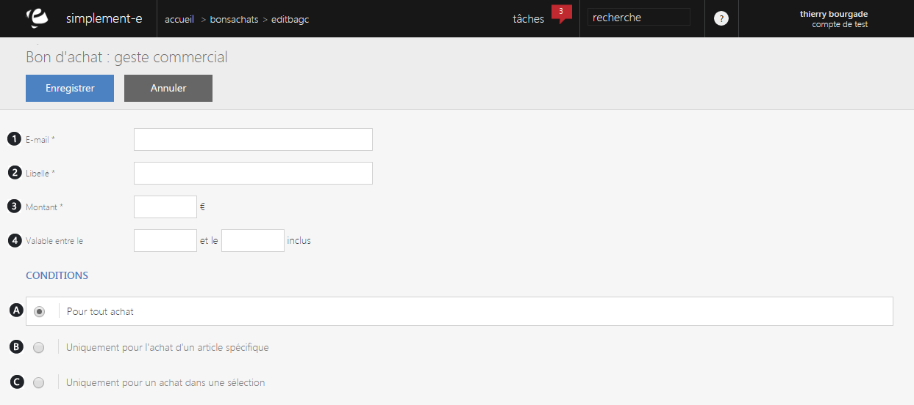
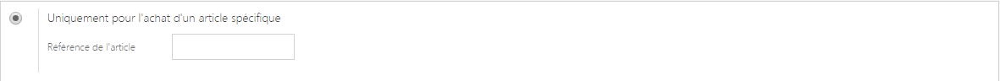
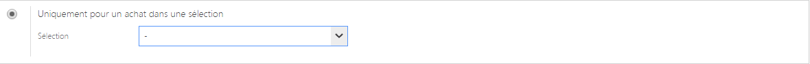

# Création d'un bon d'achat

Vous serez redirig&eacute; vers un <strong>formulaire</strong> d'&eacute;dition vous permettant de <strong>cr&eacute;er un nouveau bon d'achat.</strong>

Vous retrouverez dans ce formulaire :

<ol>
<li>L'e-mail du client,</li>
<li>Le libell&eacute; du bon d'achat,</li>
<li>Le montant impos&eacute;,</li>
<li>La date de validit&eacute; du bon d'achat.</li>
</ol>

Vous pouvez aussi pr&eacute;ciser les conditions de validit&eacute; de ce bon d'achat :

A. Pour tout les <strong>achats</strong>

B. Uniquement pour<strong> l'achat d'un article sp&eacute;cifique</strong>, le libell&eacute; de l'article s'affichera lors de la validation de la r&eacute;f&eacute;rence.

C. Uniquement pour<strong> l'achat d'un article d'une s&eacute;lection</strong>

Pour valider votre cr&eacute;ation de bon d'achat, cliquez sur le bouton bleu <strong>Enregistrer</strong>.

<h3>Modifier un bon d'achat</h3>

Pour modifier un bon d'achat d&eacute;j&agrave; existant, cliquez sur le <strong>menu d'action</strong>&nbsp;se trouvant sur la droite d'un bon d'achat.

Vous serez redirig&eacute; vers un <strong>formulaire similaire</strong> au formulaire d'&eacute;dition et vous pourrez <strong>modifier les informations</strong> que vous souhaitez.

