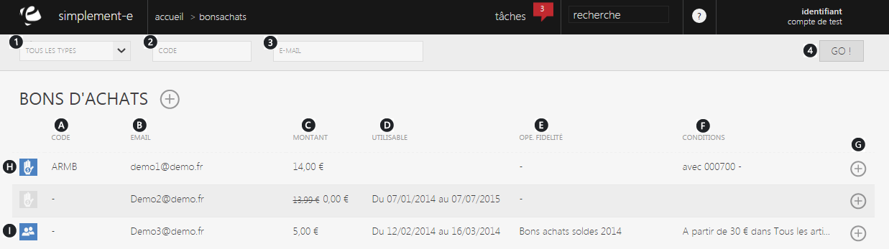
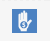

# Recherche

Un <strong>bon d'achat</strong> permet au client de <strong>poss&eacute;der un bon&nbsp;d'un montant fixe &agrave; faire valoir sur l'achat d'un article</strong>.

Dans cette page, vous retrouverez les <strong>diff&eacute;rents bons d'achats &eacute;mis pour des clients</strong>.

Vous pouvez rechercher un bon d'achat via la barre de recherche situ&eacute; sur le haut de la page.

Vous pourrez aussi <strong>cr&eacute;er</strong> un nouveau bon d'achat pour un client via la <strong>commande d'action.</strong>

<h3>Rechercher un bon d'achat</h3>

Vous pouvez lancer une recherche avec les crit&egrave;res suivants :

<ol>
<li><strong>Diff&eacute;rentes&nbsp;sources de bon d'achats</strong> (fid&eacute;lit&eacute;, geste commercial)</li>
<li>Le <strong>code</strong> du bon d'achat,</li>
<li><strong>L'e-mail</strong> du client pour qui le bon d'achat a &eacute;t&eacute; &eacute;mis.</li>
</ol>

Pour lancer la recherche, cliquez sur le bouton de lancement "<strong>Go</strong>" (4)

<h3>Vos bons d'achats</h3>

Cette partie vous donne acc&egrave;s &agrave; <strong>l'int&eacute;gralit&eacute; de vos bons d'achats</strong>, elle vous permet de les modifier ou d'acc&eacute;der &agrave; l'ensemble de leurs informations.

Vous pouvez y voir :

<ol type="a">
<li>Le <strong>code</strong> du bon d'achat,</li>
<li><strong>L'e-mail du client,</strong></li>
<li>Le <strong>motant</strong> de ce bon d'achat,</li>
<li>Sa <strong>date d'utilisation</strong>,</li>
<li><strong>L'op&eacute;ration</strong> pour lequel le bon d'achat a &eacute;t&eacute; cr&eacute;&eacute;,</li>
<li>Les <strong>conditions d'utilisations</strong>,</li>
<li>La commande d'action permettant de <strong>modifier le bon.</strong></li>
</ol>

Images repr&eacute;sentant la raison de ce bon d'achat :

<strong>- Bon d'achat pour fid&eacute;lit&eacute;</strong>,

- <strong>Bon d'achat comme geste commercial.</strong>

La<strong> commande d'action</strong> sur la droite permet de <strong>modifier</strong> votre bon d'achat.

<h3>Actions</h3>

La&nbsp;<strong>commande d'action</strong>&nbsp;que vous pouvez apercevoir pr&egrave;s du titre, correspond au menu de commande.

Ce menu vous permet d'acc&eacute;der &agrave; diff&eacute;rentes commande qui vous permettront de g&eacute;rer vos articles.

<em>Exemple</em> de commande que vous pouvez avoir :

<table>
<tbody>
<tr>
<td><strong><a href="/fr-fr/office/gestion-commerciale/commercial/bonsdachats/EditBonAchat.aspx">Nouveau </a></strong></td>
<td>&nbsp;Cette action vous&nbsp;permet de cr&eacute;er un nouveau bon d'achat.&nbsp;</td>
</tr>
</tbody>
</table>

&nbsp;

