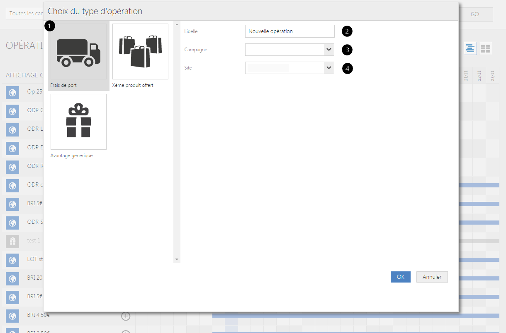

# Opérations commerciales

Ce pop-up&nbsp;vous permet de <strong>choisir et de cr&eacute;er une op&eacute;ration commerciale.&nbsp;</strong>Vous pouvez modifier ou ajouter des op&eacute;rations commerciale via vos param&egrave;tres.

Dans cette fen&ecirc;tre, vous pourrez choisir les diff&eacute;rents <strong>types d'opp&eacute;rations&nbsp;</strong>que vous souhaitez instaurer (remise, bon d'achat...).

Vous pouvez voir dans ce formulaire :

<ol>
<li>La liste de tous les <strong>types d'op&eacute;rations</strong>,</li>
<li>Le <strong>libell&eacute;</strong> que vous souhaitez donner &agrave; cette op&eacute;ration,</li>
<li>Les diff&eacute;rentes <strong>campagnes cr&eacute;&eacute;s</strong>.</li>
<li>La <strong>cible de l'op&eacute;ration commerciale</strong> (ex: site web, magasins etc)</li>
</ol>

