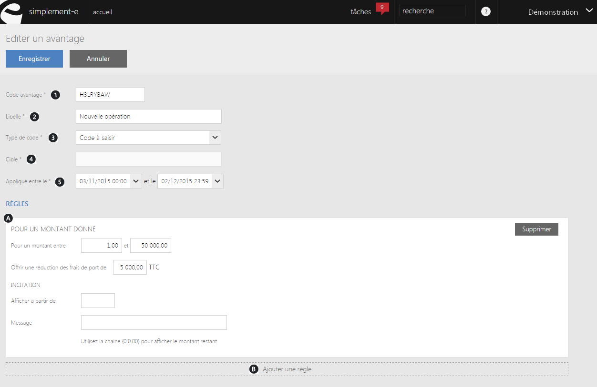
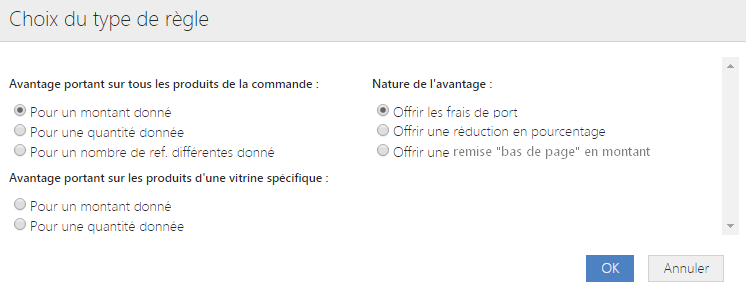

# Avantage générique

Pour acc&eacute;der &agrave; ce formulaire, il vous suffit de choisir une <strong>op&eacute;ration commerciale</strong> puis cliquer sur le bouton bleu <strong>Ok</strong> lorsque vous &eacute;tes sur la page pr&eacute;c&eacute;dente.

Ce formulaire vous permet de <strong>cr&eacute;er un code avantage &agrave; offrir &agrave; un client</strong>. Pour b&eacute;n&eacute;ficier de cet avantage, les clients doivent <strong>r&eacute;pondre &agrave; certaines r&egrave;gles</strong>.

Pour cr&eacute;er ce code avantage, vous devez saisir les <strong>informations principales</strong> suivantes :

<ol>
<li>La r&eacute;f&eacute;rence du code avantage,</li>
<li>Son libell&eacute;,</li>
<li>Les types de code applicable,</li>
<li>La cible (site e-commerce),</li>
<li>La date d'application du code avantage.</li>
</ol>
<blockquote>

&nbsp;A savoir : il existe 3 types de codes applicables :&nbsp;

- Le code &agrave; saisir n'est pas un code utilis&eacute;&nbsp;par d&eacute;faut, le client doit saisir manuellement le code pour l'activer.

- Le code avantage cumulable est une promotion permanente; Cette promotion est additionable&nbsp;au code par d&eacute;faut ou au code saisi manuellement.

- Code avantage&nbsp;applicable par d&eacute;faut.

</blockquote>

En cliquant sur <strong>Ajouter une r&egrave;gle</strong>, un<strong> pop-up</strong> avec les diff&eacute;rents type de r&egrave;gles apparaitra.&nbsp;

Plusieurs choix s'offrent &agrave; vous, <strong>cocher</strong> le <strong>type</strong> et la <strong>condition d'avantage</strong> <strong>que vous souhaitez cr&eacute;er&nbsp;</strong>:

Apr&egrave;s avoir cocher les cases souhait&eacute;es, cliquez sur <strong>Ok</strong> pour importer le formulaire.

Saisissez les donn&eacute;es demand&eacute;s afin de cr&eacute;er le code avantage.

<blockquote>

A savoir : les donn&eacute;es peuvent &ecirc;tre pour un montant ou pour une quantit&eacute;.

</blockquote>

&nbsp;Par exemple, vous devrez saisir les donn&eacute;es suivantes :

<ul>
<li>Obtenir le code avantage lorsque le&nbsp;montant du panier client est compris entre telle sommes.</li>
<li>Pr&eacute;ciser le montant pour lequel on offre les frais de port.</li>
</ul>

Vous pouvez <strong>inciter les clients &agrave; consommer</strong> en cr&eacute;ant des <strong>messages informatifs</strong> ou en <strong>affichant le montant pour lequel les frais de port sont offert</strong>.

Si vous souhaitez ajouter une r&egrave;gle, il vous suffit de cliquer sur <strong>Ajouter une r&egrave;gle,&nbsp;</strong>un autre formulaire sera cr&eacute;er en dessous de votre premier bloc.

Lorsque vous aurez terminer votre cr&eacute;ation de code, cliquez sur <strong>Enregistrer</strong> afin de cr&eacute;er votre code avantage.

