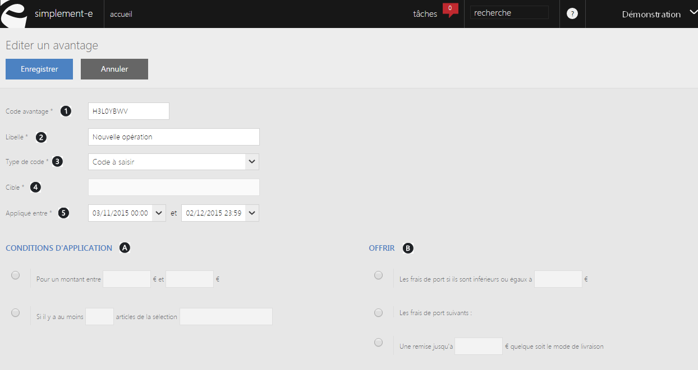
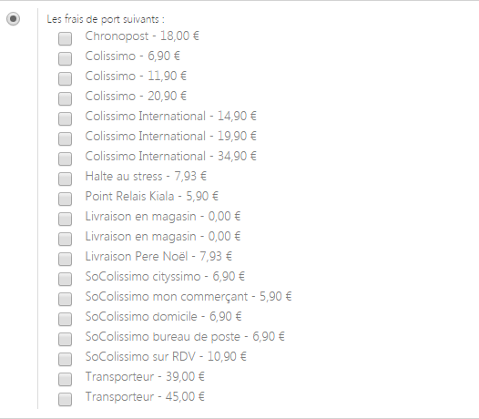

# Frais de port

Pour acc&eacute;der &agrave; ce formulaire, il vous suffit de cliquez sur le bouton bleu <strong>Ok</strong> lorsque vous &eacute;tes sur la page pr&eacute;c&eacute;dente.

Ce formulaire vous permet de <strong>cr&eacute;er un code avantage afin d'offrir les frais de port &agrave; un client</strong>. Pour b&eacute;n&eacute;ficier de ce code avantage, <strong>les clients doivent repondre &agrave; certaines conditions d'achats</strong>.

Pour cr&eacute;er ce formulaire, vous devez saisir les<strong> informations principales</strong> :

<ol>
<li>Le code avantage,</li>
<li>Le libell&eacute; de ce code,</li>
<li>Les types de code applicables,&nbsp;</li>
<li>La cible de l'avantage (site e-commerce),</li>
<li>La date d'application du code.</li>
</ol>
<blockquote>

A savoir : il existe 3 types de codes applicables :&nbsp;

- Le code &agrave; saisir n'est pas un code utilis&eacute;&nbsp;par d&eacute;faut, le client doit saisir manuellement le code pour l'activer.

- Le code avantage cumulable est une promotion permanente; Cette promotion est additionable&nbsp;au code par d&eacute;faut ou au code saisi manuellement.

- Code avantage&nbsp;applicable par d&eacute;faut.

</blockquote>

Vous devez saisir les <strong>conditions d'applications</strong> de ce code, comme :&nbsp;

<ul>
<li>Pour obtenir le code avantage, le client doit poss&eacute;der un panier compris entre certaines sommes.</li>
<li>Poss&eacute;der un panier&nbsp;avec un&nbsp;nombre d'articles d'une m&ecirc;me s&eacute;lection.</li>
</ul>

Vous devrez aussi sp&eacute;cifier les <strong>diff&eacute;rentes offres applicables</strong>, comme :

<ul>
<li>Frais de port offert s'ils sont inf&eacute;rieurs ou &eacute;gaux &agrave; un certain montant.</li>
<li>S&eacute;lectionner les frais de port &agrave; offrir :</li>
</ul>

<ul>
<li>Cr&eacute;er une remise d'un montant choisi quelque soit le mode de livraison.</li>
</ul>

Pour terminer votre cr&eacute;ation, cliquer sur <strong>Enregistrer</strong> sur le haut de la page.

